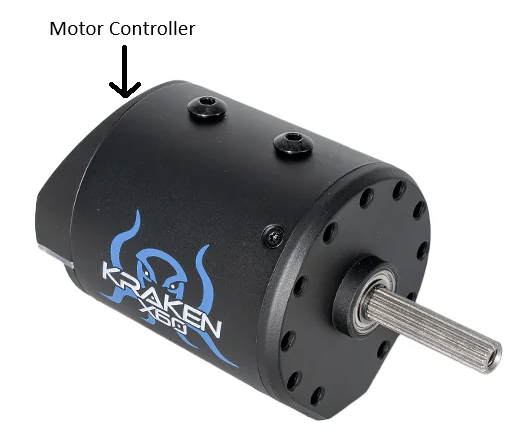

# Motor Overview

## Overview

**Motors** are devices that convert electrical energy into mechanical motion. In FRC robotics, motors are the powerhouse that make everything move - from driving the robot around the field to operating mechanisms like arms, shooters, and intakes.

---

## Types of Electric Motors

### Brushless Motors (The Newer Type)

**Team Argos Usage:**
At Team Argos, we primarily use brushless motors for our robot systems due to their superior efficiency, longevity, and performance characteristics. Our standard approach is to utilize brushless motors like the Falcon 500 and Kraken series for most applications.

**Think of it like:**
- The switching of electricity is done electronically, with smart parts, instead of physically rubbing.

**Good parts:**
- Last much, much longer because there's no rubbing to wear things out. More efficient (use less power to do the same work). Often more powerful and smoother.

**Not-so-good parts:**
- Cost a bit more upfront because they need those smart electronic parts.

**FRC legal motors:**
- Falcon, Kraken 60x, Kraken 44x, Neo

### Brushed Motors (The Older Type)

**Team Argos Usage:**
We typically only use brushed motors on prototypes because they are easier to work with.

**Think of it like:**
- Something inside physically "switches" the electricity as it spins. Like little contacts rubbing.

**Good parts:**
- Usually cheaper to make and buy. Simple.

**Not-so-good parts:**
- Those rubbing contacts wear out over time, like pencil erasers. This means they don't last as long, create some friction (which wastes a little power and makes heat), and can be a bit noisy or sparky.

**FRC legal motors:**
- CIM, Mini CIM, Bag, 775 pro, Venom

---

## Motor Controller

Think of a motor controller as the **brain for an electric motor**. Instead of just turning a motor on or off at full power like a simple switch, a motor controller lets you control it.

### Types of Motor Controllers

There are typically two main ways motor controllers work:

**Integrated Controllers:**
- The controller is built right into the motor
- Examples: Falcon 500, Kraken motors

**Non-Integrated (External) Controllers:**
- The controller is a separate unit connected by wires
- Examples: Talon SRX, Spark MAX, Victor SPX
