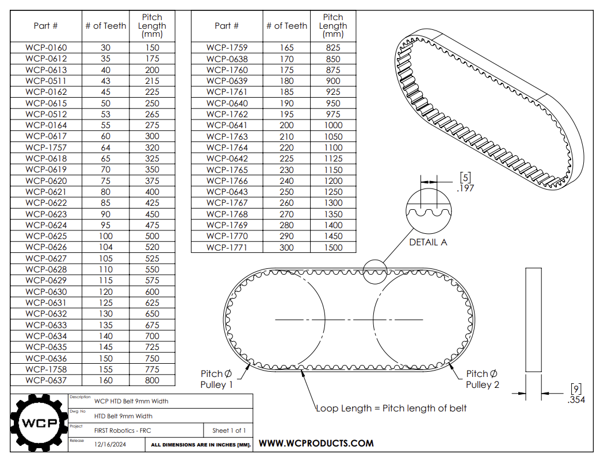
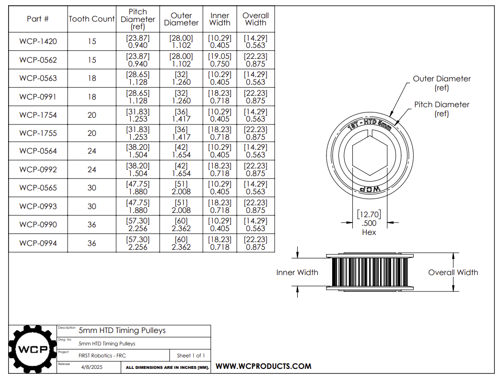

import belt_dia from './Timing_Belt_Pulley_Pitch_Diameter_and_Outside_Diameter.jpg'

# Belts and Pulleys
## Overview
- **What they are:**
    - A belt is a strong loop (like a rubber band) that connects two or more pulleys (wheels with grooves).
- **What they do:** 
    - When one pulley turns, the belt wraps around it and makes the other pulleys turn too, transferring power smoothly between them. Pulleys on their own can also help lift things or change the direction of a pull.
- **Pros:** 
    - Smooth and quiet
    - Can work over longer distances
    - Helps absorb shocks
    - Usually less expensive and easier to put together than chains or gears
    - Very little backlash
- **Cons:**
    - Can slip (loses some power)
    - Not as strong for really heavy loads as chains or gears
    - Belts can wear out
    - Fixed size belts length

        

## Argos Standard 

We use **HTD 5mm belts** and **HTD 5mm pulleys** with hex shafts. The standard pulley is **24 tooth**.

- **HTD** stands for High Torque Drive. This means the teeth on the belt and pulley have a special rounded shape designed to handle power strongly and prevent slipping.
- **5mm** refers to the pitch, which is the distance between the center of one tooth and the center of the next tooth on the belt and pulley.

  

## How to Calculate Belt Center Distance and Size
[Belt Calculator](https://wcproducts.com/pages/calculator-belt)

### Belt Calculator

import BeltCalculator from '@site/src/components/BeltCalculator';

<BeltCalculator />

### Pulleys are the Same Diameter

```math
Center Distance(in) = (Pitch × (Belt_Teeth - Pulley_Teeth)) / 50.8
```

**Where:**
- **Pitch** = 5mm for HTD belts
- **Belt_Teeth** = number of teeth on the belt
- **Pulley_Teeth** = number of teeth on the pulley

**Example**

**Belt:** 70 tooth HTD 5mm belt  
**Pulley:** 24 tooth HTD

- Pitch = 5 mm
- Belt_Teeth = 60
- Pulley_Teeth = 24

```
Center_Distance = (5 × (60-24)) / 50.8 = 3.5433 in
```

### Pulleys Different Diameter or Non-Standard Routing

You will need to add up the loop distance of the belt routed over the pulley pitch diameter.

---

## Quick Reference Guide 

---

### HTD 20 DP 5mm Belt


**Stocked Sizes**  
| Teeth | Quantity | Center Distance (in) (24 to 24 pulley)|
| ----- | -------- | -------------------- |
| 60    | 18       | 3.543                |
| 70    | 11       | 4.528                |
| 80    | 16       | 5.512                |
| 90    | 12       | 6.496                |
| 100   | 14       | 7.480                |
| 110   | 2        | 8.465                |
| 120   | 10       | 9.449                |
| 130   | 1        | 10.433               |
| 150   | 6        | 12.402               |
| 160   | 6        | 13.386               |
| 170   | 2        | 14.370               |
| 180   | 6        | 15.354               |

**Where to Buy**  
[HTD Belts - West Coast Products](https://wcproducts.com/collections/belts-chain-gears/products/htd-timing-belts-9mm-width)

---

### 1/2" Hex Shaft Pulley


**Stocked Sizes**
Available teeth: `24`

**Where to Buy**
[Hex Shaft Pulleys - West Coast Products](https://wcproducts.com/collections/belts-chain-gears/products/htd-timing-pulleys)

---

### Falcon Pulley


**Stocked Sizes**  

**Where to Buy**  
[Falcon Pulleys - West Coast Products](https://wcproducts.com/collections/belts-chain-gears/products/htd-timing-pulleys)

---
