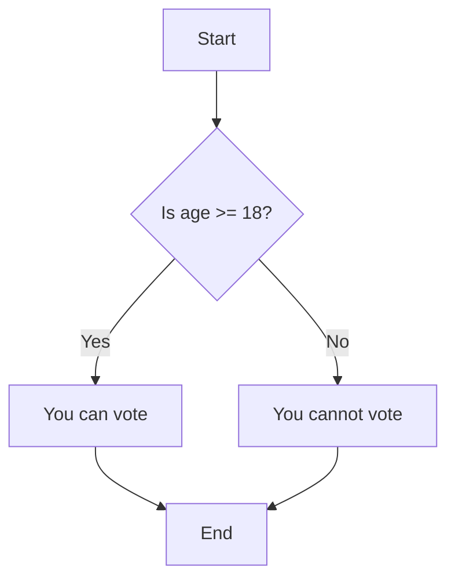

# Java Quick Reference

This page is a friendly cheat sheet for the Java you'll use to program your XRP robot.
You don't need to memorize any of it — just come back here whenever a tutorial points you
to a section.

---

## What is a Class?

In Java, almost all of your code lives inside a **class**. A class is a blueprint that
describes one part of your robot — what information it keeps track of and what it can do.

Think of a class like a blueprint for a house. The blueprint isn't a house itself, but it
describes everything about the house: how many rooms it has and what you can do in each
room. Once you have the blueprint, you can build (or "create") as many houses as you want
from it. In Java, each thing you build from a blueprint is called an **object**.

Unlike some other languages, Java keeps **everything for one class in a single file**. The
file name matches the class name. For example, a class named `Drivetrain` lives in a file
called `Drivetrain.java`.

**Example — `Drivetrain.java`:**
```java
package frc.robot.subsystems;

import edu.wpi.first.wpilibj.xrp.XRPMotor;
import edu.wpi.first.wpilibj2.command.SubsystemBase;

public class Drivetrain extends SubsystemBase {
  // Fields: the things this class keeps track of
  private final XRPMotor m_leftMotor = new XRPMotor(0);
  private final XRPMotor m_rightMotor = new XRPMotor(1);

  // Constructor: runs once when the object is created
  public Drivetrain() {}

  // A method: something this class can do
  public void tankDrive(double leftSpeed, double rightSpeed) {
    m_leftMotor.set(leftSpeed);
    m_rightMotor.set(-rightSpeed);
  }

  @Override
  public void periodic() {}
}
```

A few words you'll see a lot:

- **`public`** means other parts of your program are allowed to use this.
- **`private`** means only the code inside this class can use it. This keeps things tidy
  and safe.
- **`final`** means "this won't be pointed at something new later" — perfect for motors and
  controllers that are created once and stay put.

---

## Import Statements

Your robot project is organized into **packages** — folders that group related classes
together. The first line of most files tells Java which package the class belongs to:

```java
package frc.robot.subsystems;
```

When you want to use a class that lives in a different package (like a WPILib motor), you
add an **`import`** statement near the top of your file. An import is like telling Java,
"Hey, I'm going to use this tool — go find it for me."

```java
import edu.wpi.first.wpilibj.xrp.XRPMotor;   // a WPILib XRP motor
import frc.robot.Constants.DrivetrainConstants; // your own constants
```

**Tip:** Classes that are in the *same* package don't need an import — Java already knows
about them.

---

## Fields

A **field** (sometimes called a member variable) is a variable that belongs to a class.
Fields are where an object stores its information and its hardware, like motors or a
controller.

**Why use fields?**
- To remember information for as long as the object exists.
- To represent hardware components (like motors or controllers) in robot code.
- To keep related data and actions together inside one class.

**Example:**
```java
public class RobotContainer {
  // Subsystem field
  private final Drivetrain m_drivetrain = new Drivetrain();
  // Input device field
  private final CommandXboxController m_driverController = new CommandXboxController(0);
}
```

**Tip:** The `m_` prefix is a common convention that helps you spot a field at a glance.

---

## Flow Charts

Flow charts are visual representations of the flow of a program. They use symbols to
represent different types of actions or steps in a process.

**Common Flowchart Shapes:**

- **🟩 Rectangle (Box)**: Represents an action or process step
  - Example: "Set motor speed" or "Calculate result"
  - This is where your program *does* something

- **💎 Diamond**: Represents a decision or question
  - Example: "Is age >= 18?" or "Is button pressed?"
  - This is where your program *decides* what to do next
  - Always has "Yes/No" or "True/False" arrows coming out

- **🟢 Circle/Oval**: Represents start or end points
  - "Start" - where your program begins
  - "End" - where your program finishes

- **➡️ Arrows**: Show the direction of flow
  - Tell you which step comes next
  - From diamonds, they're labeled with the decision result (Yes/No)

**Example:**
Consider a program that checks if a person is old enough to vote (age 18 or older).



---

## Variables and Data Types

Variables are used to store data in your program. In Java, you give a variable a **data
type** that tells the computer what kind of information it will hold.

**Common Data Types:**
- `int`: Whole numbers (e.g., `42`, `-7`).
- `double`: Numbers with a decimal point (e.g., `3.14`, `-0.5`). Motor speeds use this.
- `boolean`: Either `true` or `false`.
- `char`: A single character (e.g., `'A'`).
- `String`: Text (e.g., `"Hello, World!"`).

**Example:**
```java
int age = 25;
double speed = 0.75;
boolean isPressed = true;
char grade = 'A';
String name = "Argos";
```

---

## Print Statements

Print statements let you send text to the **command line** (also called the terminal or
console). This is one of the most useful debugging tools — you can print values to see what
your program is actually doing while it runs. In WPILib, output appears in the **Driver
Station log** and the **VS Code terminal**.

There are three print methods you'll use:
- `System.out.println()` — prints text and then moves to the next line.
- `System.out.print()` — prints text and stays on the same line.
- `System.out.printf()` — prints with precise formatting using placeholders.

You can combine text and variable values using the `+` operator (called **string
concatenation**):

**Example:**
```java
int speed = 75;
String name = "Argos";
boolean isPressed = true;

System.out.println("Hello, World!");               // prints: Hello, World!
System.out.println(speed);                         // prints: 75
System.out.println("Robot name: " + name);         // prints: Robot name: Argos
System.out.println("Button pressed: " + isPressed); // prints: Button pressed: true
```

`printf` uses **placeholders** in a format string, then fills them in with the values you
list after the comma. Use `%n` for a new line at the end:

| Placeholder | Meaning           | Example output |
|-------------|-------------------|----------------|
| `%d`        | Whole number      | `42`           |
| `%.2f`      | Decimal, 2 places | `3.14`         |
| `%s`        | Text (String)     | `Argos`        |
| `%b`        | Boolean           | `true`         |
| `%n`        | New line          |                |

```java
double temperature = 98.6;

System.out.printf("Robot: %s%n", name);                  // prints: Robot: Argos
System.out.printf("Speed: %d%%%n", speed);               // prints: Speed: 75%
System.out.printf("Temp: %.1f degrees%n", temperature);  // prints: Temp: 98.6 degrees
```

**Tip:** `%%` prints a literal `%` sign — the `%` character is reserved for placeholders,
so you need two of them to print one.

---

## Methods

A **method** is a reusable block of code that performs a specific task. You can think of a
method as a named set of instructions: once you've written it, you can run all those
instructions just by calling the method's name.

In Java, you write the whole method — its name and its instructions — together in one place
inside a class.

**The parts of a method:**
```java
public void tankDrive(double leftSpeed, double rightSpeed) {
  m_leftMotor.set(leftSpeed);
  m_rightMotor.set(-rightSpeed);
}
```

- **`public`** — other parts of the code are allowed to call this method.
- **`void`** — the method *does* something but doesn't hand a value back. (If it returned a
  number you'd write `double` or `int` here instead.)
- **`tankDrive`** — the method's name.
- **`(double leftSpeed, double rightSpeed)`** — the **parameters**, the information the
  method needs to do its job. Each one has a data type and a name.
- **`{ ... }`** — the body, the actual instructions that run when you call the method.

**Calling a method:**
```java
m_drivetrain.tankDrive(0.5, -0.5);
```

---

## If-Else Statements

An `if-else` statement is how your program makes decisions. It's like asking a series of
questions. The computer checks each question in order and runs the code for the *first one*
that is true.

- **`if`**: Asks the first question.
- **`else if`**: If the first answer was "no," ask another question.
- **`else`**: If all the answers were "no," do this as a default.

**Syntax:**
```java
if (condition1) {
    // runs if condition1 is true
} else if (condition2) {
    // runs if condition2 is true
} else {
    // runs if none of the conditions are true
}
```

**Example:**
```java
int age = 20;
if (age < 13) {
    System.out.println("You are a child.");
} else if (age < 18) {
    System.out.println("You are a teenager.");
} else {
    System.out.println("You are an adult.");
}
```

---

## The Constants Class

Sometimes you have important numbers — like how fast the robot should drive — that you want
to keep in one easy-to-find place. Instead of scattering "magic numbers" all over your code,
you put them in a special **constants class**.

A constant is a value that never changes while the program runs. In a WPILib Java project,
these live in `Constants.java`. Grouping related constants inside their own nested class
keeps them organized.

**Defining constants:**
```java
// Constants.java
package frc.robot;

public final class Constants {
  public static final class DrivetrainConstants {
    public static final double kMoveSpeed = 0.75; // Speed for forward/backward (1 = max, 0 = stopped)
    public static final double kTurnSpeed = 0.5;  // Speed for turning (1 = max, 0 = stopped)
  }
}
```

- **`static final`** together mean "this value belongs to the class and never changes."
- **`double`** is the data type — a number with a decimal point.
- **`kMoveSpeed`** is the name. The `k` prefix is a common FRC convention that signals
  "this is a constant."

**Using constants** in another file — import the nested class, then use a dot to reach the
value:
```java
import frc.robot.Constants.DrivetrainConstants;

double speed = DrivetrainConstants.kMoveSpeed;
```

**Why this is better:** if the robot drives too fast, you change the number in *one place*
and it updates everywhere it's used.

---

## Objects and References

When you create something from a class, you get an **object**. A variable that holds an
object actually holds a **reference** to it — think of it like a name tag that points to the
real thing.

This matters when you hand an object to another part of your code. For example, a command
might need to use the drivetrain:

```java
public class SlowSpeedCommand extends Command {
  private final Drivetrain m_drivetrain;

  // The drivetrain is passed in and stored
  public SlowSpeedCommand(Drivetrain drivetrain) {
    m_drivetrain = drivetrain;
  }

  @Override
  public void initialize() {
    m_drivetrain.setSpeedScale(0.5); // use a dot to call its methods
  }
}
```

Because `m_drivetrain` refers to the *same* drivetrain object the rest of the robot uses,
calling `m_drivetrain.setSpeedScale(0.5)` changes the real drivetrain — not a copy.

**Simple rule:** In Java you always use a dot (`.`) to call a method on an object.

---

## Comments

Comments are notes for humans — Java ignores them when it runs your code.

```java
// This is a single-line comment

/*
  This is a
  multi-line comment
*/
```

---

## Xbox Controller

To drive your robot you'll read an Xbox controller using the `CommandXboxController` class.
It reads the joysticks and buttons and works neatly with the command-based system.

**Import and create one** (the `0` is the USB port the controller is plugged into):
```java
import edu.wpi.first.wpilibj2.command.button.CommandXboxController;

private final CommandXboxController m_driverController = new CommandXboxController(0);
```

**Reading the joysticks** (each returns a number from `-1.0` to `1.0`):
- `getLeftX()` / `getLeftY()` — left joystick
- `getRightX()` / `getRightY()` — right joystick

Note: for the Y axes, pushing the joystick *forward* gives a *negative* number, so you'll
often add a minus sign to flip it.

**Buttons as `true`/`false`** — handy when you just want to know if a button is held right
now:
```java
boolean yPressed = m_driverController.getHID().getYButton();
boolean aPressed = m_driverController.getHID().getAButton();
```

**Buttons as triggers** — used to attach commands to a button:
```java
m_driverController.a().whileTrue(new SomeCommand());
m_driverController.rightTrigger(0.5).whileTrue(new SomeCommand());
```

---

## Subsystem

A **Subsystem** is a part of your robot that does a specific job — for example a drivetrain
(for driving), an arm, or an intake. Each subsystem holds the motors and sensors for its job
and the methods that control them.

**Why use subsystems?**
- They keep your code organized — each part of the robot is managed in one place.
- Only one command can control a subsystem at a time, so you don't get conflicts.

A subsystem class `extends SubsystemBase`:
```java
import edu.wpi.first.wpilibj2.command.SubsystemBase;

public class Drivetrain extends SubsystemBase {
  public Drivetrain() {
    // set up motors and sensors here
  }

  public void drive(double speed, double rotation) {
    // code to drive the robot
  }

  @Override
  public void periodic() {
    // runs over and over while the robot is on
  }
}
```

To create one in VS Code, see [Creating a Subsystem](#creating-a-subsystem).

---

## Command

A **Command** is a reusable instruction that tells your robot to do something — like turn on
an LED, drive forward, or go into slow-speed mode. A command runs when it is scheduled,
until it is interrupted or decides it is finished.

**The four lifecycle methods** every command can fill in:
- `initialize()` — runs once when the command starts.
- `execute()` — runs over and over while the command is active.
- `end(boolean interrupted)` — runs once when the command stops.
- `isFinished()` — returns `true` when the command should stop on its own.

A command class `extends Command`:
```java
import edu.wpi.first.wpilibj2.command.Command;

public class LEDOnCommand extends Command {
  @Override
  public void initialize() {
    // turn the LED on
  }

  @Override
  public void execute() {
    // keep doing this while active
  }

  @Override
  public void end(boolean interrupted) {
    // clean up when stopping
  }

  @Override
  public boolean isFinished() {
    return false; // run until interrupted
  }
}
```

To create one in VS Code, see [Creating a Command](#creating-a-command).

---

## RunCommand

A **`RunCommand`** is a quick, built-in command that runs a chunk of code over and over. It's
perfect for the drivetrain's everyday job of reading the joysticks. You give it the code to
run (written as a little inline function, called a *lambda*, using `() -> { ... }`) and tell
it which subsystem it needs:

```java
import edu.wpi.first.wpilibj2.command.RunCommand;

m_drivetrain.setDefaultCommand(new RunCommand(
    () -> m_drivetrain.tankDrive(
        -m_driverController.getLeftY(),
        -m_driverController.getRightY()),
    m_drivetrain));
```

- `() -> { ... }` is the code to run every loop.
- The last part (`m_drivetrain`) is the **requirement** — it tells the scheduler this job
  needs the drivetrain, so nothing else uses it at the same time.

---

## XRP Motor

The XRP robot has two drive motors: a left motor and a right motor. Motor speeds range from
`-1.0` (full reverse) to `1.0` (full forward).

**Motor IDs:**
- Left Motor: `0`
- Right Motor: `1`

**Import and create motor objects:**
```java
import edu.wpi.first.wpilibj.xrp.XRPMotor;

private final XRPMotor m_leftMotor = new XRPMotor(0);
private final XRPMotor m_rightMotor = new XRPMotor(1);
```

**Common methods:**
- `set(double speed)` — sets the motor speed, from `-1.0` to `1.0`.
- `setInverted(boolean isInverted)` — flips the motor's direction. Useful because the two
  motors are mounted as mirror images of each other.
- `get()` — returns the last speed you set.

**Example:**
```java
// Make both motors spin the same way for "forward"
m_rightMotor.setInverted(true);

m_leftMotor.set(0.5);
m_rightMotor.set(0.5);
```

---

## XRP LED

The XRP has a built-in yellow LED and a USER button. Both are controlled through the
`XRPOnBoardIO` class.

**Import and create the object:**
```java
import edu.wpi.first.wpilibj.xrp.XRPOnBoardIO;

private final XRPOnBoardIO m_onboardIO = new XRPOnBoardIO();
```

**Common methods:**
- `setLed(boolean value)` — pass `true` to turn the LED on, `false` to turn it off.
- `getLed()` — returns whether the LED is currently on.
- `getUserButtonPressed()` — returns `true` if the USER button is being pressed.

**Example:**
```java
m_onboardIO.setLed(true);  // turn the LED on

boolean pressed = m_onboardIO.getUserButtonPressed();
```

---

## Creating a Subsystem

To create a new subsystem in VS Code with the WPILib extension:

1. Right-click on the `src/main/java/frc/robot/subsystems` folder in the file explorer.
2. Select **WPILib: Create a new class/command**.
3. Choose **Subsystem** from the list.
4. Name the new subsystem `Drivetrain`.
5. You should see a new file appear: `src/main/java/frc/robot/subsystems/Drivetrain.java`.

> 📷 **TBD:** Java screenshots of the "Create a new class/command" steps need to be added.

---

## Creating a Command

To create a new command in VS Code with the WPILib extension:

1. Right-click on the `src/main/java/frc/robot/commands` folder in the file explorer.
2. Select **WPILib: Create a new class/command**.
3. Choose **Command** from the list.
4. Name the new command (for example, `LEDOnCommand`).
5. You should see a new file appear: `src/main/java/frc/robot/commands/LEDOnCommand.java`.

> 📷 **TBD:** Java screenshots of the "Create a new class/command" steps need to be added.

---
