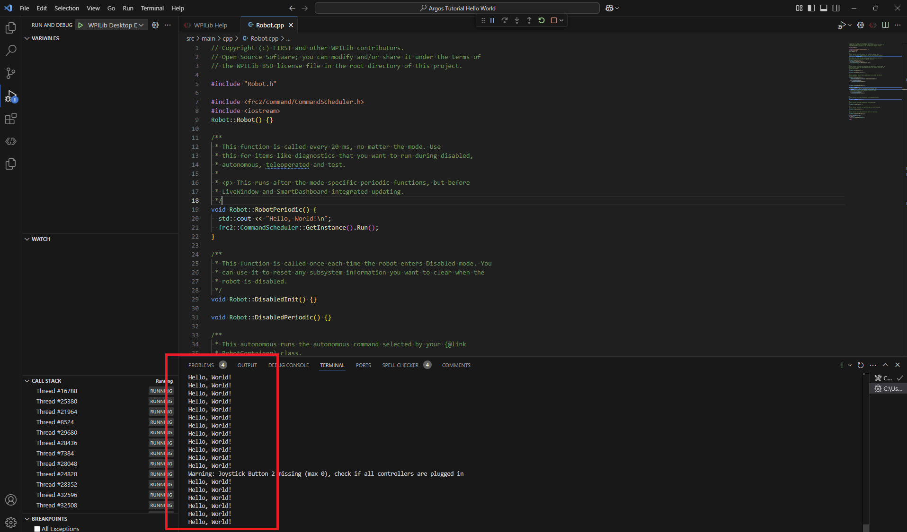

import HelloWorldQuiz from './HelloWorldQuiz';

# Hello World

Your first Java program will print a message to the console. That's it — simple on purpose.

---

## Get the Code

> Already have the project? Skip to [Open the Folder in VS Code](#open-the-folder-in-vs-code).

Clone the starter repository and open it in VS Code.

> **TBD — Java starter repository URL to be added.**

For help cloning, see: [Cloning a repository](<../../../Git GitHub/01_Version_Control/index.md#cloning-a-repository>)

---

## Open the Folder in VS Code

In VS Code, go to **File → Open Folder** and select the `01_Hello_World` folder you just cloned.

Once the folder is open, VS Code may prompt you to install recommended extensions — click **Install**.

---

## Open Robot.java

In the VS Code file explorer, go to `src/main/java/frc/robot` and open `Robot.java`.


---

## Add the Code

Find the `robotPeriodic()` method and add one line **after** `CommandScheduler.getInstance().run();`:

```java
System.out.println("Hello, World!");
```


`System.out.println(...)` prints a line of text to the console. Whatever is inside the quotes gets printed.

Think of it in three parts:
- **`System`** — Java's way of talking to the computer
- **`.out`** — the "output" channel, used for sending text out
- **`.println(...)`** — "print line," sends your text and moves to the next line

The text you want to print goes inside the parentheses, wrapped in quotes. The semicolon at the end is required — every statement in Java ends with one, like a period at the end of a sentence.

<details>
<summary>Your code should look like this</summary>

```java
@Override
public void robotPeriodic() {
    CommandScheduler.getInstance().run();

    // =================================================================
    // TUTORIAL: Hello World (02_Hello_World)
    // Add your statement on the line below:
    // =================================================================
    System.out.println("Hello, World!");
    // =================================================================
}
```

</details>

---

## Run It

See: [How to simulate your robot code](<../../../WPILib%20VSCode%20Docs/04_Simulate%20Robot%20Code/index.md>)

Watch the console output. You should see:

```
Hello, World!
```

**Congratulations — you just wrote your first program!**

Print statements are extremely helpful for debugging. They let you see exactly what your code is doing while it runs.



---

## Troubleshooting

- **Nothing printed?** Make sure you saved `Robot.java` before running.
- **Build errors?** Read the error in the terminal and fix the typo in your code.

---

## Knowledge Check

Test what you just learned before moving on to the challenge.

<HelloWorldQuiz />

---

## Challenge

Modify your program to print your **name** on one line and your **birthdate** on the next line using two `System.out.println` statements.

To learn more about printing, see the [Print Statements quick reference](<../../../Java Docs/Java_software_quick_reference/index.md#print-statements>).
