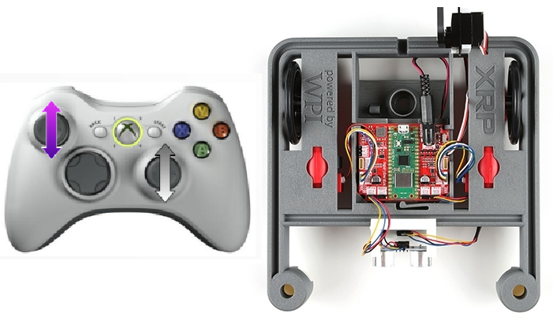

# XRP Tank Drive  

## Overview

Tank drive is a direct-drive control where one joystick is used for each side of the drive train. The left joystick moves the left motor forward and backward, and the right joystick moves the right motor forward and backward. To turn, you move one joystick forward and the other in reverse. This control scheme offers the driver complete control, but tends to have a steeper learning curve.

But, this scheme is the easiest to implement in software because of its simplicity!

If you have some experience programming, try implementing this drive control now. Otherwise, read on for step-by-step instructions.




## The Pre-Code Workout 📊

Before we write any code, it's important to make a **flow chart** of what we need
to do, in human readable tasks. When you are solving any problem in software,
it's important to do a step like this either in your head, or on paper.

Let's start with listing out the tasks we need to perform:

* Turn robot left and right
* Drive forward and back
* Read left joystick from controller
* Read right joystick from controller

### Flow Chart
 > A [flow chart](../../../Java%20Docs/Java_software_quick_reference/index.md#flow-charts) is a diagram that shows the steps in a process. Each step is represented by a different symbol and contains a short description of the process step. The flow chart symbols are linked together with arrows showing the process flow direction. It's a great way to plan your code before you start writing.

Now that we understand the overall idea of the code, let's create a flowchart to outline what our code needs to do.
Programmers use flow charts a lot to visualize a plan for implementing code. Attempt to create your own flowchart before reviewing the provided example.

<details>
<summary> Flow Chart 📊</summary>

 ```mermaid
 flowchart TD
     a[Read right joystick from controller]
     b[Read left joystick from controller]
     c[Set left motor speed]
     d[Set right motor speed]

     s(start) --> a
     a --> b
     b --> c
     c --> d
 ```

</details>

### Inputs and Outputs
Now that we understand how the code will work, we need to define the input and output of our method.   
  ***Inputs:***  These are things we would like our method to know about.   
  ***Outputs:*** These are what we would like our method to tell everyone else about.   

<details>
<summary>Define Inputs and Outputs. Try defining the Inputs and Outputs before looking.</summary>

**Inputs:** 
- `leftSpeed`: The speed value from the left joystick.
- `rightSpeed`: The speed value from the right joystick.

**Outputs:**
- `Left motor power` 
- `Right motor power`
</details> 

While simple, it's important to keep the tasks at hand straight. I will walk you through how to do each of these things in code in the next section.

## Time to Start Coding

## Clone Repository

Before we start coding, you need to get the robot code on your computer. This is called **cloning** a repository.

> **TBD — Java starter repository URL to be added.** A Java version of the XRP tutorial project does not exist yet. Once it is created, the clone URL will be added here.

For detailed instructions on how to clone the repository, please follow the guide for [cloning a repository](<../../../Git GitHub/01_Version_Control/index.md#cloning-a-repository>).

Once your repository is cloned, return to this tutorial to write your first lines of Java code.

### Create a Drivetrain Subsystem
The first step is to create a subsystem for our drivetrain. See [How to Create a Subsystem](<../../../Java%20Docs/Java_software_quick_reference/index.md#creating-a-subsystem>) for instructions on how to do this. You should name your subsystem `Drivetrain`.

###  The Drivetrain.java File

**What is a Class in Java?** <br />
Imagine you have a big toolbox, and inside it are all the specialized tools (methods and fields) you need to build something.

In Java, all the code for one part of your robot lives together in a single **class** file. A class named `Drivetrain` lives in a file called `Drivetrain.java`. That one file holds both *what* the drivetrain can do and *how* it does it.

At the top of the file you'll see `import` statements. An `import` is like telling Java, "Hey, I'm going to use this tool — go find it for me." For more on this, see [Packages and Import Statements](../../../Java%20Docs/Java_software_quick_reference/index.md#import-statements).

1. We need to tell the software we want to use the XRP robot motors. To do this we will need to import the motor class, see [XRP Quick Reference Guide](<../../../Java%20Docs/Java_software_quick_reference/index.md#xrp-motor>) for more details on working with motors.


    1. We will need to add the following import to the top of the `Drivetrain.java` file, with the other imports:
    ```java
    import edu.wpi.first.wpilibj.xrp.XRPMotor;
    ```

2. Now we need to tell our code about the two motors on the robot. Think of this like giving a name to each motor so we can command it later. In programming, we call these "objects". We need one for the left motor and one for the right. The robot knows which is which by a channel number. For the XRP, the left motor is channel `0` and the right motor is channel `1`. 
    1. Let's add the code to create these motor objects inside our `Drivetrain` class. We'll make them `private`, which means only the `Drivetrain` code can talk to the motors directly, which helps keep our project organized. We also mark them `final` because each motor is created once and never replaced.
     ```java
       // This creates an object for the left motor on channel 0
       private final XRPMotor m_leftMotor = new XRPMotor(0);
       // This creates an object for the right motor on channel 1
       private final XRPMotor m_rightMotor = new XRPMotor(1);
     ```
3. Finally, we need to create a way to tell the drivetrain how to move. We'll do this by creating a [method](../../../Java%20Docs/Java_software_quick_reference/index.md#methods). A method is just a named set of instructions. We'll name our method `tankDrive`. Our `tankDrive` method needs to know how fast each motor should go, so we'll give it two inputs: `leftSpeed` and `rightSpeed`. We need to make this method `public`, which just means that other parts of the robot's code (like the code for the joystick) are allowed to use it.
    1. Add the method to the `Drivetrain` class:
     ```java
       // A method to drive the robot with tank-style controls.
       // It takes a speed for the left side and a speed for the right side.
       public void tankDrive(double leftSpeed, double rightSpeed) {
         // This line tells our left motor object to set its speed to the value of leftSpeed.
         m_leftMotor.set(leftSpeed);
         // This line does the same for the right motor, using the rightSpeed value.
         m_rightMotor.set(rightSpeed);
       }
     ```

 <details>
 <summary>What do all those symbols mean?</summary>
        Just like English has grammar rules, programming languages do too. We call it 'syntax'. Let's look at the syntax for our method, piece by piece.
        *   `public void tankDrive(double leftSpeed, double rightSpeed)`
            *   Think of this as the method's full name and job description.
            *   `public` means other parts of the code are allowed to call this method.
            *   `void` means "this method just *does* something, it doesn't give you anything back." It's like telling someone "Go!" instead of asking "What time is it?".
            *   `tankDrive` is the method's name.
            *   The part in the parentheses `( ... )` lists the ingredients the method needs to do its job. In this case, it needs two numbers (which can have decimals, called `double`s): one named `leftSpeed` and one named `rightSpeed`.
        *   `{ ... }`
            *   The curly braces are like the borders of a recipe card. All the instructions for the method go inside them.
        *   `m_leftMotor.set(leftSpeed);`
            *   This is a single command, like one step in a recipe.
            *   `m_leftMotor` is the motor we want to talk to.
            *   The `.` is like saying "'s" in English. So this is like "the left motor's..."
            *   `set(leftSpeed)` is the command we are giving it. We're telling it to "Set your speed to whatever number `leftSpeed` is."
            *   The `;` at the end is like a period. It tells the computer that this command is finished.
 </details>

 * **Inverting a Motor**. If you were to run the code right now and push both joysticks forward, your robot would probably just spin in a circle.
    
    * **Why does this happen?**

       1. Think about the wheels on a toy car. To make it go forward, the wheels on the right side have to spin the opposite way from the wheels on the left side (one spins clockwise, the other counter-clockwise). Our motors are mounted as mirror images of each other, so telling them both to go "forward" with a positive speed makes them spin the same way, causing the robot to turn.
    
   * **How do we fix it?**

      * We need to "invert" one of the motors, which just means telling it to do the opposite of what we command. We can do this by simply putting a minus sign `-` in front of the speed value for one of the motors.

   * **Let's update our `tankDrive` method to invert the right motor.**

       ```java
       public void tankDrive(double leftSpeed, double rightSpeed) {
         m_leftMotor.set(leftSpeed);
         // The minus sign here tells the right motor to spin the opposite way.
         m_rightMotor.set(-rightSpeed);
       }
       ```
       Now, when you push both joysticks forward, the `rightSpeed` will be made negative, the right motor will spin in the opposite direction of the left motor, and your robot will drive straight!

 <details>
 <summary>Your Drivetrain.java file should look like this</summary>
 
``` java
// Copyright (c) FIRST and other WPILib contributors.
// Open Source Software; you can modify and/or share it under the terms of
// the WPILib BSD license file in the root directory of this project.

package frc.robot.subsystems;

import edu.wpi.first.wpilibj.xrp.XRPMotor;
import edu.wpi.first.wpilibj2.command.SubsystemBase;

public class Drivetrain extends SubsystemBase {
  // This creates an object for the left motor on channel 0
  private final XRPMotor m_leftMotor = new XRPMotor(0);
  // This creates an object for the right motor on channel 1
  private final XRPMotor m_rightMotor = new XRPMotor(1);

  public Drivetrain() {}

  // A method to drive the robot with tank-style controls.
  // It takes a speed for the left side and a speed for the right side.
  public void tankDrive(double leftSpeed, double rightSpeed) {
    // This line tells our left motor object to set its speed to the value of leftSpeed.
    m_leftMotor.set(leftSpeed);
    // This line does the same for the right motor, using the rightSpeed value.
    m_rightMotor.set(-rightSpeed);
  }

  // This method will be called once per scheduler run
  @Override
  public void periodic() {}
}
```
 </details>

### The RobotContainer.java File

 **What is the Robot Container?**

 Imagine your robot is a person. We've already built the `Drivetrain`, which is like the robot's legs. We also have a joystick, which is like the robot's ears for hearing commands.

 The `RobotContainer` is like the robot's **brain**. It's the central place where everything gets connected. The brain's job is to:

 1.  **Know about all the parts:** It holds onto our `Drivetrain` subsystem and our joystick.
 2.  **Connect them:** It listens to the joystick (the ears) and tells the `Drivetrain` (the legs) what to do.

 Now let's add our parts to the brain.

 1.  First, we need to tell our `RobotContainer` (the brain) where to find the blueprints for our `Drivetrain`, our `CommandXboxController`, and the `RunCommand` we'll use to connect them. We do this by adding `import` statements at the top of `RobotContainer.java`. For more details on the controller, see the [Xbox Controller quick reference](<../../../Java%20Docs/Java_software_quick_reference/index.md#xbox-controller>).

     ```java
     import edu.wpi.first.wpilibj2.command.RunCommand;
     import edu.wpi.first.wpilibj2.command.button.CommandXboxController;
     import frc.robot.subsystems.Drivetrain;
     ```

 2.  Next, we need to create the actual `Drivetrain` and `CommandXboxController` objects inside our `RobotContainer`. Think of this as giving the brain its own set of legs and ears to use. We'll declare these as `private final` fields to keep our code organized.

     ```java
       // Create an instance of our Drivetrain subsystem
       private final Drivetrain m_drivetrain = new Drivetrain();

       // Create an instance of the Xbox Controller on USB port 0
       private final CommandXboxController m_driverController = new CommandXboxController(0);
     ```

 3.  **Setting the Drivetrain's Default Job**

     We need to tell the `Drivetrain` what it should be doing by default: listening to our joysticks. We do this by setting its "Default Command". This command will run automatically whenever no other special commands are using the drivetrain.

     In `RobotContainer.java`, find the `configureBindings()` method. This is where we'll add the code to link the controller to our `tankDrive` method.

     ```java
       // Set the default command for the drivetrain.
       // This will run whenever no other command is running on the drivetrain.
       m_drivetrain.setDefaultCommand(new RunCommand(
           () -> m_drivetrain.tankDrive(
               -m_driverController.getLeftY(),
               -m_driverController.getRightY()),
           m_drivetrain));
     ```

     **What does this code do?**
     *   It tells the `m_drivetrain` to run a command by default.
     *   The command continuously gets the Y-axis value from the left and right joysticks.
     *   It sends those values to our `tankDrive` method. We use a minus sign (`-`) because the joystick's Y-axis is inverted (pushing forward gives a negative number).

 <details>
 <summary>Let's break down that code syntax</summary>

 Let's look at that block of code line-by-line. Think of it like giving a set of instructions to a robot chef.

 ```java
 m_drivetrain.setDefaultCommand(...);
 ```
 *   **This says:** "Hey Drivetrain, I'm about to give you your default job."
 *   `m_drivetrain` is our robot's drivetrain.
 *   The `.` is like saying "'s".
 *   `setDefaultCommand` is the instruction we are giving it. The job we put inside the `()` is what it will do whenever it has nothing else to do.

 ```java
 new RunCommand( ... )
 ```
 *   **This says:** "The job is a 'Run Command', which means you'll do it over and over, very fast."
 *   This is a special type of command from the WPILib toolbox that's perfect for things that need constant updates, like reading a joystick.

 ```java
 () -> m_drivetrain.tankDrive( ... )
 ```
 *   **This is a sticky note with instructions.** The `() -> ...` is a small, nameless function called a *lambda*. It's the list of steps to do every loop.

 ```java
 m_drivetrain.tankDrive(
    -m_driverController.getLeftY(),
    -m_driverController.getRightY()
 )
 ```
 *   **This is the main instruction on the sticky note.**
 *   `m_drivetrain.tankDrive(...)` tells the drivetrain to use the `tankDrive` method we wrote earlier.
 *   `-m_driverController.getLeftY()` gets the position of the **left joystick** (up/down). We use a **minus sign `-`** because pushing the joystick *up* gives a *negative* number, and we need to flip it to be positive for "forward".
 *   `-m_driverController.getRightY()` does the exact same thing for the **right joystick**.

 ```java
 m_drivetrain
 ```
 *   **This says:** "By the way, this job requires the drivetrain."
 *   This is a note for the robot's main scheduler. It makes sure that no two commands try to use the drivetrain at the exact same time, which would cause chaos.

 </details>

 <details>
 <summary>Your RobotContainer.java file should look like this</summary>

 ```java
 // Copyright (c) FIRST and other WPILib contributors.
 // Open Source Software; you can modify and/or share it under the terms of
 // the WPILib BSD license file in the root directory of this project.

 package frc.robot;

 import edu.wpi.first.wpilibj2.command.Command;
 import edu.wpi.first.wpilibj2.command.RunCommand;
 import edu.wpi.first.wpilibj2.command.button.CommandXboxController;

 import frc.robot.subsystems.Drivetrain;

 /**
  * This class is where the bulk of the robot should be declared. Since
  * Command-based is a "declarative" paradigm, very little robot logic should
  * actually be handled in the {@link Robot} periodic methods (other than the
  * scheduler calls). Instead, the structure of the robot (including subsystems,
  * commands, and trigger mappings) should be declared here.
  */
 public class RobotContainer {
   // Create an instance of our Drivetrain subsystem
   private final Drivetrain m_drivetrain = new Drivetrain();

   // Create an instance of the Xbox Controller on USB port 0
   private final CommandXboxController m_driverController = new CommandXboxController(0);

   public RobotContainer() {
     configureBindings();
   }

   private void configureBindings() {
     // Set the default command for the drivetrain.
     // This will run whenever no other command is running on the drivetrain.
     m_drivetrain.setDefaultCommand(new RunCommand(
         () -> m_drivetrain.tankDrive(
             -m_driverController.getLeftY(),
             -m_driverController.getRightY()),
         m_drivetrain));
   }

   public Command getAutonomousCommand() {
     return null;
   }
 }
 ```

 </details>

## Time to test your code
Need help connecting to the XRP robot? See: [Connecting to the XRP Robot](../../../XRP%20Docs/04_Connecting_to_XRP/index.md)

Great job writing your first XRP code.  it is time to test your code.  Go to [XRP Run Code](<../../../WPILib%20VSCode%20Docs/04_Simulate%20Robot%20Code/index.md>) to test your code.


If everything is working correctly, you can now drive your XRP robot using the left and right joysticks.

---

## Challenge: Level Up Your Tank Drive 🚀

Ready to go beyond the basics? Try one (or many) of these mini‑challenges to improve control, readability, and driver experience.

- Add a constant speed or turning scale (ex: 60% power) so the robot is easier to control
- Add a small deadband (ignore tiny joystick values like ±0.1) so the robot doesn't creep.
- Print the left and right joystick values to the console for debugging.

### Tips
- Make only one change at a time—test after each.
- Keep your code tidy this will help you better understand your code

When you've completed a challenge, describe what you improved and why. That thinking habit is how you become a great controls programmer. 🔧

---
