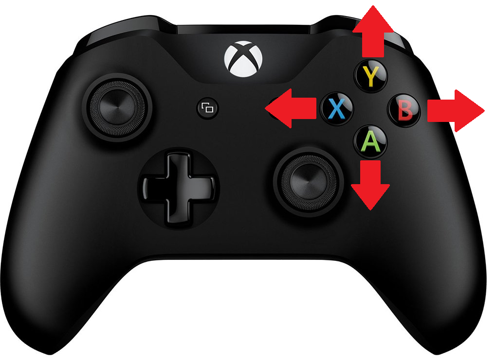
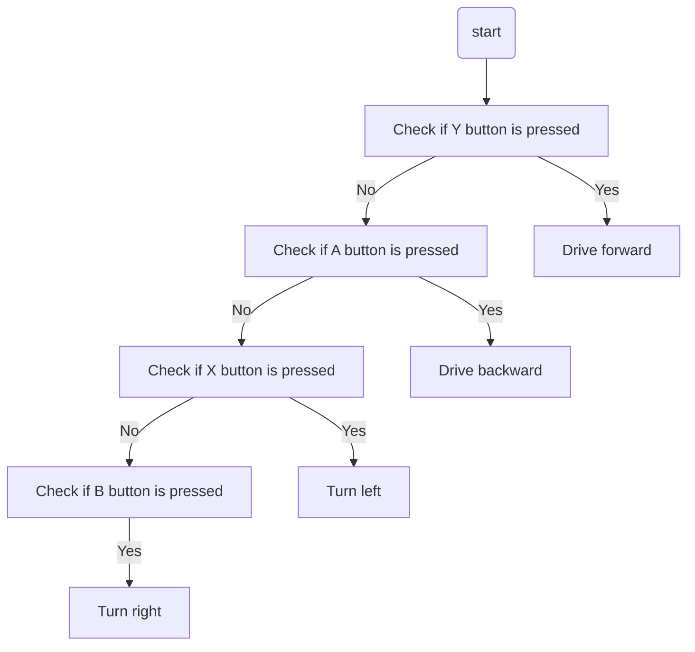

# XRP Button Drive  
## Overview
> This tutorial builds on the [XRP Tank Drive tutorial](../03_XRP_Tank_Drive/index.md). If you have not completed that one, please do so before continuing.

As you might have noticed in tank drive tutorial, driving the robot using the left and right joystick to control the power to each wheel can be difficult to control. Let's try to make something a little easier to control.

Button drive is a control scheme where specific buttons on an Xbox controller are used to control the robot's movement. For example:
- Pressing the **Y** button drives the robot forward.
- Pressing the **A** button drives the robot backward.
- Pressing the **X** button turns the robot left.
- Pressing the **B** button turns the robot right.



If you have some experience programming, try implementing this drive control now. Otherwise, read on for step-by-step instructions.

## The Pre-Code Workout 📊

Before writing any code, let's break down the tasks into a **flow chart**. This helps us visualize the steps needed to implement button-based driving.

Let's start with listing out the tasks we need to perform:
* Drive forward when the **Y** button is pressed.
* Drive backward when the **A** button is pressed.
* Turn left when the **X** button is pressed.
* Turn right when the **B** button is pressed.

### Flow Chart:
Now lets make a [Flow Chart](../../../Java%20Docs/Java_software_quick_reference/index.md#flow-charts).   Try this on your own before looking at the flow chart
<details>
<summary>Flow Chart 📊</summary>


</details>

### Inputs and Outputs
Now that we understand how the code will work we need to define the input and output of our method. It is important to also define the [data types](../../../Java%20Docs/Java_software_quick_reference/index.md#variables-and-data-types) for these inputs and outputs.

<details>
<summary>Define Inputs and Outputs.  Try defining the Inputs and Outputs before looking.</summary>

**Inputs:** 
- `forward`: Indicating if the forward button is pressed (Y): Datatype (boolean).
- `backward`: Indicating if the backward button is pressed (A): Datatype (boolean).
- `turnLeft`: Indicating if the turn left button is pressed (X): Datatype (boolean).
- `turnRight`: Indicating if the turn right button is pressed (B): Datatype (boolean).

**Outputs:**
- `Left motor power`: Left motor speed: Datatype (double).
- `Right motor power`: Right motor speed: Datatype (double).
</details> 

---


## Time to Start Coding

## Clone Repository

Before we start coding, you need to get the robot code on your computer. This is called **cloning** a repository.

> **TBD — Java starter repository URL to be added.** A Java version of the XRP tutorial project does not exist yet. Once it is created, the clone URL will be added here.

For detailed instructions on how to clone the repository, please follow the guide for [cloning a repository](<../../../Git GitHub/01_Version_Control/index.md#cloning-a-repository>).

Once your repository is cloned, return to this tutorial to write your first lines of Java code.

### Create a Drivetrain Subsystem

The first step is to create a subsystem for our drivetrain. See [How to Create a Subsystem](<../../../Java%20Docs/Java_software_quick_reference/index.md#creating-a-subsystem>) for instructions on how to do this. You should name your subsystem `Drivetrain`.

### The Drivetrain.java File

Just as a reminder, in Java all the code for one part of your robot lives together in a single **class** file. We are about to add a new method to our `Drivetrain` class.  

1. We need to tell the software we want to use the XRP robot motors. To do this we will need to import the motor class, see [Controlling a Motor](<../../../Java%20Docs/Java_software_quick_reference/index.md#xrp-motor>) for more details on controlling the XRP robot motor.
    1. We will need to add the following import to the top of the `Drivetrain.java` file:
    ```java
    import edu.wpi.first.wpilibj.xrp.XRPMotor;
    ```
2. Now we need to tell our code about the two motors on the robot. 
    1. Let's add the code to create these motor objects inside our `Drivetrain` class. We'll make them `private final`. Making them `private` means only the `Drivetrain` code can talk to the motors directly, which helps keep our project organized.
     ```java
       // This creates an object for the left motor on channel 0
       private final XRPMotor m_leftMotor = new XRPMotor(0);
       // This creates an object for the right motor on channel 1
       private final XRPMotor m_rightMotor = new XRPMotor(1);
     ```

3. We will be adding a `buttonDrive` method to the class.   
   ```java
    // A method to drive the robot with button drive controls.
    // It takes button presses and turns them into left and right motor speeds.
    public void buttonDrive(boolean forward, boolean backward, boolean turnLeft, boolean turnRight) {

    }
   ```
<details>
<summary>What does this method definition mean?</summary>

- **`public`**: Other parts of the code are allowed to call this method.
- **`void`**: This is the method's return type. `void` means this method does not return any value after it runs; it only performs actions.
- **`buttonDrive`**: This is the name we've given our method.
- **`(boolean forward, ...)`**: The parentheses contain the method's **parameters** (the inputs). Each parameter has a data type and a name.
  - `boolean forward`: A parameter named `forward` that expects a `boolean` (true/false) value.
  - `boolean backward`: A parameter named `backward` that expects a `boolean` (true/false) value.
  - `boolean turnLeft`: A parameter named `turnLeft` that expects a `boolean` (true/false) value.
  - `boolean turnRight`: A parameter named `turnRight` that expects a `boolean` (true/false) value.
</details>

  Next, we will add the code inside the `buttonDrive` method. This method will use an `if / else if / else` statement to determine the robot's movement based on the button inputs. If you're unfamiliar with `if-else` statements, refer to the [if-else statements guide](../../../Java%20Docs/Java_software_quick_reference/index.md#if-else-statements) for more details. We will be writing our code in between the `{}` of `buttonDrive`.

  Here is the implementation:

  ```java
  // Check if the forward button is pressed
  if (forward) {
    m_leftMotor.set(1);   // Drive forward
    m_rightMotor.set(-1); // Drive forward (inverted)
  }
  // Check if the backward button is pressed
  else if (backward) {
    m_leftMotor.set(-1);  // Drive backward
    m_rightMotor.set(1);  // Drive backward (inverted)
  }
  // Check if the turnLeft button is pressed
  else if (turnLeft) {
    m_leftMotor.set(-1);  // Turn left
    m_rightMotor.set(-1); // Turn left
  }
  // Check if the turnRight button is pressed
  else if (turnRight) {
    m_leftMotor.set(1);   // Turn right
    m_rightMotor.set(1);  // Turn right
  }
  // If no buttons are pressed, stop the robot
  else {
    m_leftMotor.set(0.0);  // Stop
    m_rightMotor.set(0.0); // Stop
  }
  ```
<details>
<summary>Your Drivetrain.java file should look like this.</summary>

  ```java
  // Copyright (c) FIRST and other WPILib contributors.
  // Open Source Software; you can modify and/or share it under the terms of
  // the WPILib BSD license file in the root directory of this project.

  package frc.robot.subsystems;

  import edu.wpi.first.wpilibj.xrp.XRPMotor;
  import edu.wpi.first.wpilibj2.command.SubsystemBase;

  public class Drivetrain extends SubsystemBase {
    // This creates an object for the left motor on channel 0
    private final XRPMotor m_leftMotor = new XRPMotor(0);
    // This creates an object for the right motor on channel 1
    private final XRPMotor m_rightMotor = new XRPMotor(1);

    public Drivetrain() {}

    // A method to drive the robot with button drive controls.
    // It takes button presses and turns them into left and right motor speeds.
    public void buttonDrive(boolean forward, boolean backward, boolean turnLeft, boolean turnRight) {
      // Check if the forward button is pressed
      if (forward) {
        m_leftMotor.set(1);   // Drive forward
        m_rightMotor.set(-1); // Drive forward (inverted)
      }
      // Check if the backward button is pressed
      else if (backward) {
        m_leftMotor.set(-1);  // Drive backward
        m_rightMotor.set(1);  // Drive backward (inverted)
      }
      // Check if the turnLeft button is pressed
      else if (turnLeft) {
        m_leftMotor.set(-1);  // Turn left
        m_rightMotor.set(-1); // Turn left
      }
      // Check if the turnRight button is pressed
      else if (turnRight) {
        m_leftMotor.set(1);   // Turn right
        m_rightMotor.set(1);  // Turn right
      }
      // If no buttons are pressed, stop the robot
      else {
        m_leftMotor.set(0.0);  // Stop
        m_rightMotor.set(0.0); // Stop
      }
    }

    // This method will be called once per scheduler run
    @Override
    public void periodic() {}
  }
  ```
</details>

### The RobotContainer.java File
We will now need to open `RobotContainer.java`.  
1.  First, we need to add the `import` statements for our `Drivetrain`, our `CommandXboxController`, and the `RunCommand` we'll use to connect them, at the top of `RobotContainer.java`.

     ```java
     import edu.wpi.first.wpilibj2.command.RunCommand;
     import edu.wpi.first.wpilibj2.command.button.CommandXboxController;
     import frc.robot.subsystems.Drivetrain;
     ```
2.  Next, we need to create the actual `Drivetrain` and `CommandXboxController` objects inside our `RobotContainer`. Think of this as giving the brain its own set of legs and ears to use. We'll declare these as `private final` fields. For more details on the controller, see the [Xbox Controller quick reference](<../../../Java%20Docs/Java_software_quick_reference/index.md#xbox-controller>).

     ```java
       // Create an instance of our Drivetrain subsystem
       private final Drivetrain m_drivetrain = new Drivetrain();

       // Create an instance of the Xbox Controller on USB port 0
       private final CommandXboxController m_driverController = new CommandXboxController(0);
     ```

3.  **Setting the Drivetrain's Default Job**

     We need to tell the `Drivetrain` what it should be doing by default: listening to our buttons. We do this by setting its "Default Command". This command will run automatically whenever no other special commands are using the drivetrain.

     In `RobotContainer.java`, find the `configureBindings()` method. This is where we'll add the code to link the controller to our `buttonDrive` method.

     ```java
       // Set the default command for the drivetrain.
       // This will run whenever no other command is running on the drivetrain.
       m_drivetrain.setDefaultCommand(new RunCommand(
           () -> {
             // Read the buttons
             boolean forward = m_driverController.getHID().getYButton();
             boolean backward = m_driverController.getHID().getAButton();
             boolean left = m_driverController.getHID().getXButton();
             boolean right = m_driverController.getHID().getBButton();
             // Drive with button controls
             m_drivetrain.buttonDrive(forward, backward, left, right);
           },
           m_drivetrain));
     ```

<details>
<summary>Why do we use m_driverController.getHID().getYButton() instead of just m_driverController.y()?</summary>

We use `m_driverController.getHID().getYButton()` instead of just `m_driverController.y()` because `CommandXboxController` provides two ways to work with buttons:
- **Trigger methods** (like `.y()`, `.a()`, etc.) return special `Trigger` objects used for binding commands to button events (like running a command when a button is pressed or released).
- **getHID() button methods** (like `.getHID().getYButton()`) return simple `boolean` values (true/false) that tell us if the button is currently pressed right now.

Since our `buttonDrive` method needs simple true/false values to decide how to move, we use `getHID()` to get the raw button state.
</details>

<details>
<summary>Your RobotContainer.java file should look like this.</summary>     

```java
// Copyright (c) FIRST and other WPILib contributors.
// Open Source Software; you can modify and/or share it under the terms of
// the WPILib BSD license file in the root directory of this project.

package frc.robot;

import edu.wpi.first.wpilibj2.command.Command;
import edu.wpi.first.wpilibj2.command.RunCommand;
import edu.wpi.first.wpilibj2.command.button.CommandXboxController;

import frc.robot.subsystems.Drivetrain;

public class RobotContainer {
  // Create an instance of our Drivetrain subsystem
  private final Drivetrain m_drivetrain = new Drivetrain();

  // Create an instance of the Xbox Controller on USB port 0
  private final CommandXboxController m_driverController = new CommandXboxController(0);

  public RobotContainer() {
    configureBindings();
  }

  private void configureBindings() {
    // Set the default command for the drivetrain.
    // This will run whenever no other command is running on the drivetrain.
    m_drivetrain.setDefaultCommand(new RunCommand(
        () -> {
          // Read the buttons
          boolean forward = m_driverController.getHID().getYButton();
          boolean backward = m_driverController.getHID().getAButton();
          boolean left = m_driverController.getHID().getXButton();
          boolean right = m_driverController.getHID().getBButton();
          // Drive with button controls
          m_drivetrain.buttonDrive(forward, backward, left, right);
        },
        m_drivetrain));
  }

  public Command getAutonomousCommand() {
    return null;
  }
}
```

</details>


## Time to test your code
Need help connecting to the XRP robot? See: [Connecting to the XRP Robot](../../../XRP%20Docs/04_Connecting_to_XRP/index.md)

Great job writing your first XRP code.  it is time to test your code. Go to [XRP Run Code](<../../../WPILib%20VSCode%20Docs/04_Simulate%20Robot%20Code/index.md>) to test your code


If everything is working correctly, you can now drive your XRP robot using the buttons

---

## Next Steps

You've built a working button drive, but you might notice the robot moves or turns too quickly. The speeds are hardcoded as `1` and `-1`, which makes them hard to adjust. 
In the next tutorial, we'll learn how to "tune" these values by replacing them with named constants, making our code much cleaner and easier to adjust.

➡️ **Continue to [Tuning with a Constants Class](../05_Tuning/index.md)**

---

## Challenge: Level Up Your Button Drive 🚀

Ready to go beyond the basics? Try one (or a few) of these mini‑challenges to make button drive cleaner and more driver friendly:

- Tune your speed values (try values like 1.0 → 0.8 → 0.6) until the robot is easier to drive; write down what you chose and why.
- Add a slow/precision mode (hold a bumper to scale all speeds lower).
- (Stretch) Add a reverse orientation toggle so "forward" can flip when driving from the opposite side.

### Tips
- Make one change at a time—test after each.
- Keep notes on what felt better and why; it helps future tuning.

When you finish a challenge, briefly explain your reasoning. That habit builds strong control system thinking. 🔧

---
