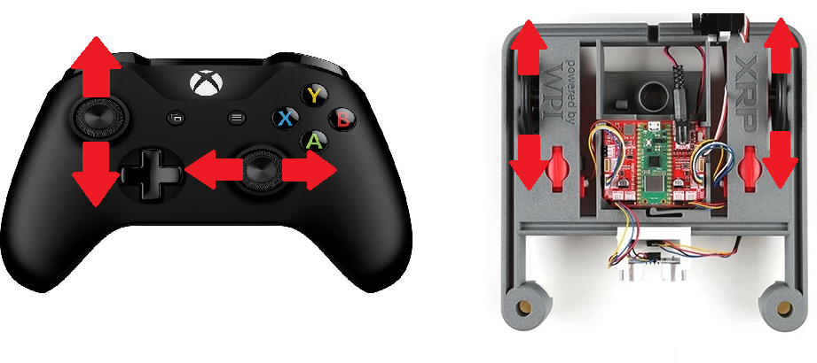
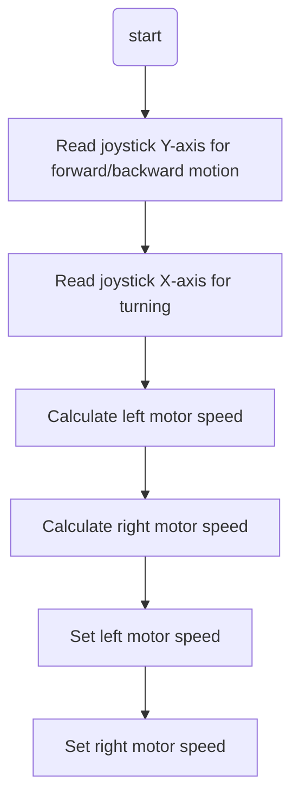

# XRP Arcade Drive  
## Overview
You saw that tank drive gave you a ton of control, but it was really hard to drive smoothly. Then, button drive was super easy to use, but you lost a lot of that fine-tuned control. Now, let's try arcade drive to find a good mix!

Arcade drive may be more familiar, because it is the basis of many video games. One joystick moves the robot forward and backward, and the same joystick turns left and right. To do this, we will use the joystick's up/down value to set a base speed for both motors, and the joystick's left/right value to increase or decrease the motor speeds to turn the robot. This control scheme offers less driver control, but it's easy to learn and many drivers enjoy it.  



If you have already implemented the Tank Drive tutorial, you can build on that project to add Arcade Drive functionality. No need to create a new project!

## The Pre-Code Workout 📊

Before writing any code, let's plan our `arcadeDrive` method. This method will translate joystick inputs into motor speeds, combining forward/backward motion and turning into a single control scheme.

### Inputs and Outputs

The method needs two inputs from the joystick and will produce two outputs to control the motors.

*   **Inputs**:
    1.  **`speed` (double)**: Controls forward/backward motion (from the joystick's Y-axis).
    2.  **`turning` (double)**: Controls turning motion (from the joystick's X-axis).

*   **Outputs**:
    *   **Left Motor Speed**: Calculated as `speed - turning`.
    *   **Right Motor Speed**: Calculated as `speed + turning`.

### Tasks:
1. Read joystick Y-axis for forward/backward motion.
2. Read joystick X-axis for turning.
3. Calculate left and right motor speeds based on the inputs.
4. Set the motor speeds to control the robot.

### Flow Chart:
<details>
<summary>Flow Chart 📊</summary>


</details>

## Time to Start Coding

## Clone Repository

Before we start coding, you need to get the robot code on your computer. This is called **cloning** a repository.

> **TBD — Java starter repository URL to be added.** A Java version of the XRP tutorial project does not exist yet. Once it is created, the clone URL will be added here.

For detailed instructions on how to clone the repository, please follow the guide for [cloning a repository](<../../../Git GitHub/01_Version_Control/index.md#cloning-a-repository>).

Once your repository is cloned, return to this tutorial to write your first lines of Java code.

### Create a Drivetrain Subsystem

The first step is to create a subsystem for our drivetrain. See [How to Create a Subsystem](../../../Java%20Docs/Java_software_quick_reference/index.md#creating-a-subsystem) for instructions on how to do this. You should name your subsystem `Drivetrain`.


### The Drivetrain.java File

For more information on what a class is, see [What is a Class](../../../Java%20Docs/Java_software_quick_reference/index.md#what-is-a-class).

Navigate to your `Drivetrain.java` file. Here are the steps you need to follow:

1. **Import the XRP Motor class.**  
   Add the necessary `import` statement at the top of your file so you can use the XRP motor objects.  
   If you need help, see the [XRP Motor Quick Reference](../../../Java%20Docs/Java_software_quick_reference/index.md#xrp-motor).

2. **Add the motor objects.**  
   Create objects for the left and right motors.  
   For more details, refer to the [XRP Motor Quick Reference](../../../Java%20Docs/Java_software_quick_reference/index.md#xrp-motor).

3. **Add the arcadeDrive method.**  
   In your class, add the `arcadeDrive` method.  
   If you need help with Java methods, check the [Methods Quick Reference](../../../Java%20Docs/Java_software_quick_reference/index.md#methods).

4. **Add the method body.**  
  This is where we will do the math to get the left and right motor speeds:
  ``` java
    // Set the speed of the left and right motors based on the arcade drive inputs
    double leftMotor = speed - turning;
    double rightMotor = speed + turning;

    m_leftMotor.set(leftMotor);
    m_rightMotor.set(rightMotor);
  ```

5. **Invert the left motor.**  
  We need to invert the left motor in the constructor so both motors drive in the same direction. The left and right motors are mounted facing opposite directions on the XRP robot, so we need to invert one of them. We put this in the constructor because it only needs to be set once when the subsystem is created, rather than every time we call the `arcadeDrive` method. Add this to the `Drivetrain()` constructor:
  ``` java
  public Drivetrain() {
    m_leftMotor.setInverted(true);
  }
  ```

<details>
<summary>Your Drivetrain.java file should look like this.</summary>

``` java
// Copyright (c) FIRST and other WPILib contributors.
// Open Source Software; you can modify and/or share it under the terms of
// the WPILib BSD license file in the root directory of this project.

package frc.robot.subsystems;

import edu.wpi.first.wpilibj.xrp.XRPMotor;
import edu.wpi.first.wpilibj2.command.SubsystemBase;

public class Drivetrain extends SubsystemBase {
  // This creates an object for the left and right motor
  private final XRPMotor m_leftMotor = new XRPMotor(0);
  private final XRPMotor m_rightMotor = new XRPMotor(1);

  public Drivetrain() {
    m_leftMotor.setInverted(true); // Invert the left motor here
  }

  // arcadeDrive has two inputs: speed and turning.
  public void arcadeDrive(double speed, double turning) {
    // Set the speed of the left and right motors based on the arcade drive inputs
    double leftMotor = speed - turning;
    double rightMotor = speed + turning;

    m_leftMotor.set(leftMotor);
    m_rightMotor.set(rightMotor);
  }

  // This method will be called once per scheduler run
  @Override
  public void periodic() {}
}
```
</details>


### The RobotContainer.java File

The `RobotContainer.java` file is where you set up your robot's main structure, including subsystems and input devices.

Navigate to your `RobotContainer.java` file. Here's what you need to do:

1. **Import the Drivetrain Subsystem**  
   Add an `import` statement for your `Drivetrain` class so you can use your drivetrain subsystem. If you need help, see [Import Statements](../../../Java%20Docs/Java_software_quick_reference/index.md#import-statements)

2. **Create the Drivetrain Subsystem**  
   Add a field for your `Drivetrain` subsystem. If you need help see [Fields](../../../Java%20Docs/Java_software_quick_reference/index.md#fields)

3. **Import and create your Xbox controller**  
   Import and create a `CommandXboxController`. If you need help see [Xbox Controller](../../../Java%20Docs/Java_software_quick_reference/index.md#xbox-controller)

4. **Import RunCommand**  
   Add `import edu.wpi.first.wpilibj2.command.RunCommand;` for creating inline commands.

5. **Set the default command**  
   Set up the drivetrain's default command to continuously run arcade drive with joystick inputs. Add this code to the `configureBindings()` method:
   ```java
   m_drivetrain.setDefaultCommand(new RunCommand(
       () -> m_drivetrain.arcadeDrive(m_driverController.getLeftY(), m_driverController.getLeftX()),
       m_drivetrain));
   ```
   This creates a `RunCommand` that calls the `arcadeDrive` method with the left joystick's Y-axis (forward/backward) and X-axis (turning) values. The command runs continuously as the drivetrain's default behavior.

<details>
<summary>Your RobotContainer.java file should look like this:</summary>

```java
// Copyright (c) FIRST and other WPILib contributors.
// Open Source Software; you can modify and/or share it under the terms of
// the WPILib BSD license file in the root directory of this project.

package frc.robot;

import edu.wpi.first.wpilibj2.command.Command;
import edu.wpi.first.wpilibj2.command.RunCommand;
import edu.wpi.first.wpilibj2.command.button.CommandXboxController;

import frc.robot.subsystems.Drivetrain;

public class RobotContainer {
  private final Drivetrain m_drivetrain = new Drivetrain();
  private final CommandXboxController m_driverController = new CommandXboxController(0);

  public RobotContainer() {
    configureBindings();
  }

  private void configureBindings() {
    m_drivetrain.setDefaultCommand(new RunCommand(
        () -> m_drivetrain.arcadeDrive(m_driverController.getLeftY(), m_driverController.getLeftX()),
        m_drivetrain));
  }

  public Command getAutonomousCommand() {
    return null;
  }
}
```
</details>


## Time to test your code
Now that you've implemented the arcade drive functionality, it's time to test your code!

Need help connecting to the XRP robot? See: [Connecting to the XRP Robot](../../../XRP%20Docs/04_Connecting_to_XRP/index.md)

### Deploy and Test

Great job writing your first XRP code.  it is time to test your code. Go to [XRP Run Code](../../../WPILib%20VSCode%20Docs/04_Simulate%20Robot%20Code/index.md) to test your code

### Testing Checklist

- [ ] Robot moves forward when you push the left joystick forward (up)
- [ ] Robot moves backward when you pull the left joystick backward (down)
- [ ] Robot turns right when you push the left joystick to the right
- [ ] Robot turns left when you push the left joystick to the left
- [ ] Robot can move forward/backward and turn at the same time


---

## Challenge: Refine Your Arcade Drive 🚀

Ready to polish the feel of arcade drive? Pick a few of these mini‑challenges:

- Add overall scaling constants in `Constants.java` (e.g., kDriveScale, kTurnScale) and multiply raw joystick values before combining; tune until it feels natural.
- Add input deadband (ignore tiny joystick values) to reduce drift.
- Prevent motor outputs from exceeding [-1, 1] after combining forward and turn.

### Tips
- Change one thing at a time; test immediately.
- Start conservative (lower speeds) then build up.
- Keep notes: which adjustment made driving smoother?

---
