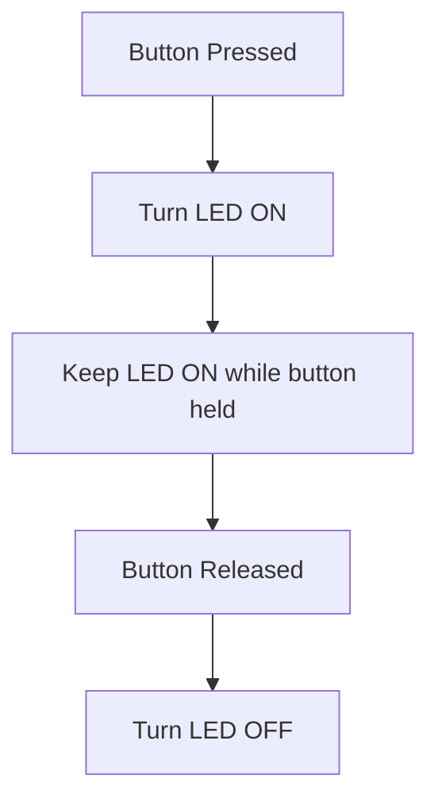

# XRP LED Command Tutorial

## Overview

In this tutorial, you'll learn how to create your first **command** to control the XRP robot's onboard LED. Commands are like individual tasks that your robot can perform - think of them as simple instructions like "turn on the LED" or "turn off the LED".

We'll create a simple command that turns the yellow LED on when you press and hold a button on your controller, and turns it off when you release the button. This is a perfect first step into command-based programming!

---

## What are Commands?

Think of commands like giving your robot a simple instruction to follow. For example:
- "Turn on the LED"
- "Turn off the LED"
- "Keep the LED on while I hold this button"

Commands are useful because they:
- Keep your code organized
- Can be triggered by button presses
- Can run continuously while a button is held

In this tutorial, we'll create a command called `LEDOnCommand` that turns the LED on and keeps it on while the button is pressed.

For more information on commands see [Command Quick Reference](<../../../Java%20Docs/Java_software_quick_reference/index.md#command>)

---

## The Pre-Code Workout 📊

Before writing code, let's plan what we need to do:

### Tasks we need to perform:
* Create a command to turn the LED on
* Bind the command to a controller button (on when pressed, off when released)
* Test our code

### Flow Chart

If you need a reminder on how flow charts work, see [Flow Charts Quick Reference](<../../../Java%20Docs/Java_software_quick_reference/index.md#flow-charts>)

<details>
<summary>Try to create the flow chart before you look at it.</summary>



</details>

### Inputs and Outputs

**Inputs:** 
- Button press and hold from controller

**Outputs:**
- LED on while button is pressed
- LED off when button is released

---

## Time to Start Coding

## Clone Repository

Before we start coding, you need to get the robot code on your computer. This is called **cloning** a repository.

> **TBD — Java starter repository URL to be added.** A Java version of the XRP tutorial project does not exist yet. Once it is created, the clone URL will be added here.

For detailed instructions on how to clone the repository, please follow the guide for [cloning a repository](<../../../Git GitHub/01_Version_Control/index.md#cloning-a-repository>).

Once your repository is cloned, return to this tutorial to write your first lines of Java code.

### Create the LED On Command

We need to create a command that turns the LED on and keeps it on while running. See [How to Create a Command](<../../../Java%20Docs/Java_software_quick_reference/index.md#creating-a-command>) for instructions. You should name your command `LEDOnCommand`.

### The LEDOnCommand.java File

Our command will turn the LED on when it starts and keep it on while it runs. In Java, a command is a class that `extends Command`.

1. **Import the XRP onboard IO class** at the top of `LEDOnCommand.java`:

   ```java
   import edu.wpi.first.wpilibj.xrp.XRPOnBoardIO;
   ```

2. **Add the onboard IO object** as a `private final` field:

   ```java
   // Create an object for the onboard IO (LED and button)
   private final XRPOnBoardIO m_onboardIO = new XRPOnBoardIO();
   ```

3. **Fill in the command's lifecycle methods.** Every command can override four methods. Let's write each one:

   - **`initialize()`** runs once when the command starts. Turn the LED on here:

     ```java
     @Override
     public void initialize() {
       // Turn the LED on when the command starts
       m_onboardIO.setLed(true);
     }
     ```

   - **`execute()`** runs repeatedly while the command is active. We don't need to do anything here:

     ```java
     @Override
     public void execute() {
       // Nothing needed here - we just want to keep the LED on
     }
     ```

   - **`end(boolean interrupted)`** runs when the command stops. Turn the LED off here:

     ```java
     @Override
     public void end(boolean interrupted) {
       // Turn the LED off when the command ends
       m_onboardIO.setLed(false);
     }
     ```

   - **`isFinished()`** tells the scheduler when the command is done. We return `false` so it runs until interrupted:

     ```java
     @Override
     public boolean isFinished() {
       // This command never finishes on its own - it will run until interrupted
       return false;
     }
     ```

<details>
<summary>Your LEDOnCommand.java file should look like this</summary>

```java
// Copyright (c) FIRST and other WPILib contributors.
// Open Source Software; you can modify and/or share it under the terms of
// the WPILib BSD license file in the root directory of this project.

package frc.robot.commands;

import edu.wpi.first.wpilibj.xrp.XRPOnBoardIO;
import edu.wpi.first.wpilibj2.command.Command;

/** A command that turns the XRP LED on and keeps it on. */
public class LEDOnCommand extends Command {
  // Create an object for the onboard IO (LED and button)
  private final XRPOnBoardIO m_onboardIO = new XRPOnBoardIO();

  public LEDOnCommand() {
    // No requirements needed since we're not using subsystems
  }

  // Called when the command is initially scheduled.
  @Override
  public void initialize() {
    // Turn the LED on when the command starts
    m_onboardIO.setLed(true);
  }

  // Called repeatedly while this command is scheduled to run.
  @Override
  public void execute() {
    // Nothing needed here - we just want to keep the LED on
  }

  // Called once the command ends or is interrupted.
  @Override
  public void end(boolean interrupted) {
    // Turn the LED off when the command ends
    m_onboardIO.setLed(false);
  }

  // Returns true when the command should end.
  @Override
  public boolean isFinished() {
    // This command never finishes on its own - it will run until interrupted
    return false;
  }
}
```
</details>

### Update RobotContainer.java

Now we need to add our command to the robot container so we can use it.

1. **Import the command class** at the top of `RobotContainer.java`:

   ```java
   import frc.robot.commands.LEDOnCommand;
   ```

2. **Import the Xbox controller class and create the controller instance** so we can bind buttons:

   ```java
   import edu.wpi.first.wpilibj2.command.button.CommandXboxController;

   // In the RobotContainer class, create the controller on USB port 0
   private final CommandXboxController m_driverController = new CommandXboxController(0);
   ```

3. **Bind the command to a controller button** so we can trigger it. We want the LED to be on while the button is pressed and off when released. Add this to the `configureBindings()` method:

   ```java
   // Bind the LED command to the A button
   // whileTrue means the command runs while the button is held down.
   // When the button is released, the command will end (and turn off the LED).
   m_driverController.a().whileTrue(new LEDOnCommand());
   ```

<details>
<summary>What does this button binding code mean?</summary>

Let's break down this line of code:

```java
m_driverController.a().whileTrue(new LEDOnCommand());
```

- `m_driverController.a()` - Gets the A button from our Xbox controller as a trigger.
- `.whileTrue(...)` - Runs the command while the button is held down. When the button is released, the command ends.
- `new LEDOnCommand()` - Creates a new instance of our `LEDOnCommand` (which turns the LED on).

So altogether, this line says: "While the A button is pressed, run the LEDOnCommand (which turns the LED on). When the button is released, stop the command (which turns the LED off)."

The key difference from `onTrue()` is that `whileTrue()` keeps the command running as long as the button is held down, and automatically stops it when the button is released.

</details>

## Time to Test Your Code

Great job! You've created your first command to control the XRP LED. Now it's time to test it.

Need help connecting to the XRP robot? See: [Connecting to the XRP Robot](../../../XRP%20Docs/04_Connecting_to_XRP/index.md)

### Testing Steps:

1. **Build your code** - Make sure there are no errors
2. **Deploy to simulator** - Follow the [XRP Simulation Guide](<../../../WPILib%20VSCode%20Docs/04_Simulate%20Robot%20Code/index.md>)
3. **Test the functionality**:
   - Connect an Xbox controller to your computer
   - Start the robot code
   - Press and hold the **A button** on your controller
   - You should see the LED turn on while the button is held

### What Should Happen:

- **When you press and hold the A button**: LED turns ON
- **While you keep holding the A button**: LED stays ON  
- **When you release the A button**: LED turns OFF immediately
- **Press and hold again**: LED turns ON again

### Troubleshooting:

If the LED doesn't respond:
- Check that your controller is connected (USB port 0)
- Make sure you're **holding down** the **A button** (not just pressing it once)
- Verify that the robot code is running and enabled
- Check the console output for any error messages

---

## Congratulations! 🎉

You've just created your first command! This is a big step in learning robot programming. Here's what you accomplished:

- ✅ Created a **command** to control hardware (the LED)
- ✅ Connected a **controller button** to trigger the command
- ✅ Learned the basic structure of command programming

### What You Learned:

1. **Commands** - Define specific actions the robot can perform  
2. **Button Bindings** - Connect user input to robot actions
3. **Command Lifecycle** - initialize, execute, end, and isFinished methods
4. **XRP Hardware** - How to control the onboard LED

### Next Steps:

Now that you understand the basics of commands, you can:
- Create commands that run for a specific amount of time
- Make commands that control motors
- Learn about subsystems for organizing your code
- Build more complex behaviors by combining multiple commands

Great work, and welcome to the world of robot programming! 🤖

---

## Challenge: Extend Your LED Command 🚀

Ready to go further? Try one or more of these mini‑challenges:

- Change the command to use a different button (try B or X instead of A).
- Make a new command that blinks the LED while held (on/off every half second).
- Add a second command to turn the LED off with a different button, regardless of its current state.
- Create a "toggle" command: each press of the button flips the LED on or off (not just while held).

### Tips
- Change one thing at a time and test.
- If something doesn't work, add printouts to see what's happening.
- Think about how you'd organize more commands as your robot grows.


---
