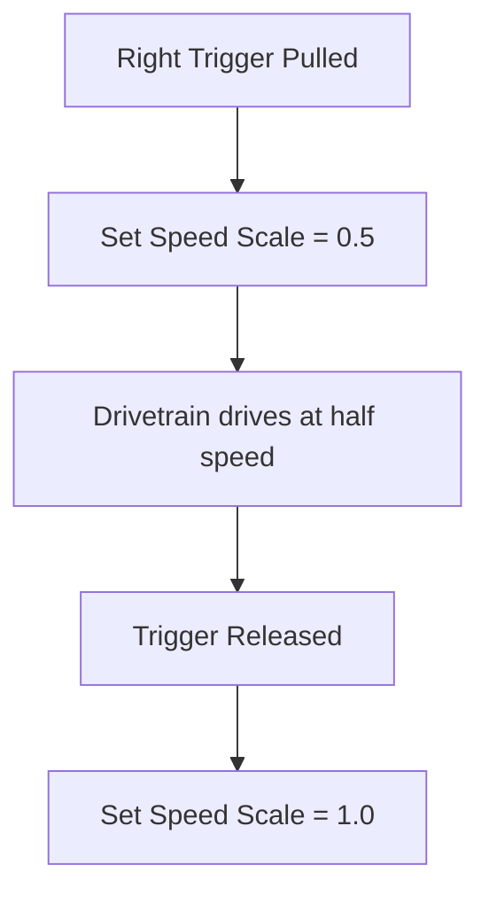

# XRP Slow Speed Mode with Commands

## Overview

Building on the arcade drive tutorial, you'll now add a **slow speed mode** feature to your XRP robot! When you pull the Xbox controller trigger, the robot will enter a slow speed mode that reduces all movement by 50%. This feature is incredibly useful for:

- **Precise positioning** when you need fine control
- **Safety** when operating in tight spaces
- **Learning** to help new drivers get comfortable with robot control

We'll implement this using a **command** to handle the slow speed functionality, giving you more practice with command-based programming while adding a practical feature to your robot.


This tutorial builds directly on the [Arcade Drive Tutorial](../06_Arcade_Drive/index.md). Make sure you've completed that tutorial first!

---

## The Pre-Code Workout 📊

Before writing code, let's plan our `SlowSpeedCommand`:

### What This Command Will Do:
1. **Watch the controller trigger** - The command runs while the right trigger is pulled
2. **Apply speed reduction** - Tell the drivetrain to scale all inputs by 0.5 while active
3. **Maintain normal arcade drive** - Keep all the same driving behavior, just slower

### Inputs and Outputs:

**Inputs:**
- Right trigger pulled (more than halfway)
- Normal arcade drive inputs (forward/turn from joysticks)

**Outputs:**
- Modified motor speeds (50% of normal when trigger is pressed)

### Tasks:
1. Create a `SlowSpeedCommand` that changes the drivetrain's speed scale
2. Update the drivetrain to support speed scaling
3. Bind the command to the right trigger
4. Test the slow speed functionality

### Flow Chart:

<details>
<summary>Flow Chart 📊</summary>


</details>

---

## Time to Start Coding

### Prerequisites
This tutorial builds on the [Arcade Drive Tutorial](../06_Arcade_Drive/index.md). Make sure you have:
- A working XRP project with arcade drive
- A `Drivetrain` subsystem with an `arcadeDrive()` method
- Xbox controller already configured

If you don't have these, complete the Arcade Drive tutorial first!

### Step 1: Update the Drivetrain Subsystem

First, we need to modify our drivetrain to support speed scaling with a field.

Navigate to your `Drivetrain.java` file and add these new pieces.

**Add a speed scale field** (a place for the robot to remember how fast it should go):
```java
// Speed scale factor (1.0 = normal, 0.5 = half speed)
private double m_speedScale = 1.0;
```

:::tip Why do we need m_speedScale? 🤔
Think of `m_speedScale` like the robot's **memory**!

- The robot needs to remember "Am I supposed to go slow or fast?"
- `m_speedScale` is where the robot writes down this answer
- Once written down, the robot remembers until someone changes it
- Without it, the robot would forget immediately!
:::

**Add a method to change the speed scale:**
```java
public void setSpeedScale(double scale) {
  m_speedScale = scale;
}
```

**Update your existing `arcadeDrive` method** to use the speed scale:
```java
public void arcadeDrive(double speed, double turning) {
  // Apply the current speed scale
  double scaledSpeed = speed * m_speedScale;
  double scaledTurning = turning * m_speedScale;

  // Set the speed of the left and right motors
  double leftMotor = scaledSpeed - scaledTurning;
  double rightMotor = scaledSpeed + scaledTurning;

  m_leftMotor.set(leftMotor);
  m_rightMotor.set(rightMotor);
}
```

<details>
<summary>Your updated Drivetrain.java file should look like this:</summary>

```java
// Copyright (c) FIRST and other WPILib contributors.
// Open Source Software; you can modify and/or share it under the terms of
// the WPILib BSD license file in the root directory of this project.

package frc.robot.subsystems;

import edu.wpi.first.wpilibj.xrp.XRPMotor;
import edu.wpi.first.wpilibj2.command.SubsystemBase;

public class Drivetrain extends SubsystemBase {
  // This creates an object for the left and right motor
  private final XRPMotor m_leftMotor = new XRPMotor(0);
  private final XRPMotor m_rightMotor = new XRPMotor(1);

  // Speed scale factor (1.0 = normal, 0.5 = half speed)
  private double m_speedScale = 1.0;

  public Drivetrain() {
    m_leftMotor.setInverted(true);
  }

  public void arcadeDrive(double speed, double turning) {
    // Apply the current speed scale
    double scaledSpeed = speed * m_speedScale;
    double scaledTurning = turning * m_speedScale;

    // Set the speed of the left and right motors
    double leftMotor = scaledSpeed - scaledTurning;
    double rightMotor = scaledSpeed + scaledTurning;

    m_leftMotor.set(leftMotor);
    m_rightMotor.set(rightMotor);
  }

  public void setSpeedScale(double scale) {
    m_speedScale = scale;
  }

  // This method will be called once per scheduler run
  @Override
  public void periodic() {}
}
```
</details>

### Step 2: Create the Slow Speed Command

Now let's create a simple command that sets the speed scale when triggered.

See [How to Create a Command](<../../../Java%20Docs/Java_software_quick_reference/index.md#creating-a-command>) for instructions. You should name your command `SlowSpeedCommand`.

Our command needs access to the drivetrain since it just sets the speed scale.

1. **Import the Drivetrain class** at the top of `SlowSpeedCommand.java`:

   ```java
   import frc.robot.subsystems.Drivetrain;
   ```

2. **Add a field to store the drivetrain**, and a constructor that receives it:

   ```java
   private final Drivetrain m_drivetrain;

   public SlowSpeedCommand(Drivetrain drivetrain) {
     m_drivetrain = drivetrain;
   }
   ```

:::tip How does the command use the drivetrain? 🤔
When we write `new SlowSpeedCommand(m_drivetrain)`, we hand the command the *same* drivetrain object the rest of the robot uses. In Java, the variable `m_drivetrain` is a **reference** — like a name tag pointing at the real drivetrain.

So when the command calls `m_drivetrain.setSpeedScale(0.5)`, it changes the real drivetrain, not a copy. You always use a dot (`.`) to call a method on an object.

📚 **For more, see the [Objects and References section](<../../../Java%20Docs/Java_software_quick_reference/index.md#objects-and-references>).**
:::

3. **Fill in the lifecycle methods:**

   - **`initialize()`** - set the drivetrain to slow speed when the command starts:

     ```java
     @Override
     public void initialize() {
       m_drivetrain.setSpeedScale(0.5);
     }
     ```

   - **`execute()`** - nothing to do; the drivetrain automatically uses the speed scale:

     ```java
     @Override
     public void execute() {
       // Nothing to do! The default command keeps handling joystick input.
     }
     ```

   - **`end(boolean interrupted)`** - return to normal speed when the command ends:

     ```java
     @Override
     public void end(boolean interrupted) {
       m_drivetrain.setSpeedScale(1.0);
     }
     ```

   - **`isFinished()`** - runs until released, so it never finishes on its own:

     ```java
     @Override
     public boolean isFinished() {
       return false;
     }
     ```

<details>
<summary>Your SlowSpeedCommand.java file should look like this:</summary>

```java
// Copyright (c) FIRST and other WPILib contributors.
// Open Source Software; you can modify and/or share it under the terms of
// the WPILib BSD license file in the root directory of this project.

package frc.robot.commands;

import edu.wpi.first.wpilibj2.command.Command;
import frc.robot.subsystems.Drivetrain;

/**
 * A command that sets the drivetrain to slow speed mode.
 * Simply changes the speed scale factor for precise control.
 */
public class SlowSpeedCommand extends Command {
  private final Drivetrain m_drivetrain;

  public SlowSpeedCommand(Drivetrain drivetrain) {
    m_drivetrain = drivetrain;
  }

  // Called when the command is initially scheduled.
  @Override
  public void initialize() {
    // Set the drivetrain to slow speed mode
    m_drivetrain.setSpeedScale(0.5);
  }

  // Called repeatedly while this command is scheduled to run.
  @Override
  public void execute() {
    // Nothing to do! The default command keeps handling joystick input.
  }

  // Called once the command ends or is interrupted.
  @Override
  public void end(boolean interrupted) {
    // Return to normal speed when the command ends
    m_drivetrain.setSpeedScale(1.0);
  }

  // Returns true when the command should end.
  @Override
  public boolean isFinished() {
    // This command runs continuously while triggered, so never finishes on its own.
    return false;
  }
}
```
</details>

### Step 3: Update RobotContainer

Now we need to integrate our slow speed command into the robot container and set up the controller bindings.

#### Update RobotContainer.java

1. **Import the new command class**:

   ```java
   import frc.robot.commands.SlowSpeedCommand;
   ```

2. **Make sure you have the drivetrain subsystem** (you should already have this from the arcade drive tutorial):

   ```java
   import frc.robot.subsystems.Drivetrain;

   private final Drivetrain m_drivetrain = new Drivetrain();
   ```

3. **Set up the controller binding** for slow speed mode. In your `configureBindings()` method, add the trigger binding:

   ```java
   // Bind slow speed mode to the right trigger.
   // whileTrue means the command runs while the trigger is pulled past halfway.
   m_driverController.rightTrigger(0.5).whileTrue(new SlowSpeedCommand(m_drivetrain));
   ```

4. **Set up the default driving command** for normal driving (you should already have this from the arcade drive tutorial):

   ```java
   // Set the default command for the drivetrain to be arcade drive.
   // The speed scale is automatically applied inside arcadeDrive now!
   m_drivetrain.setDefaultCommand(new RunCommand(
       () -> m_drivetrain.arcadeDrive(
           -m_driverController.getLeftY(),  // Forward/backward
           m_driverController.getRightX()), // Turning
       m_drivetrain));
   ```

<details>
<summary>Your complete RobotContainer.java file should look like this:</summary>

```java
// Copyright (c) FIRST and other WPILib contributors.
// Open Source Software; you can modify and/or share it under the terms of
// the WPILib BSD license file in the root directory of this project.

package frc.robot;

import edu.wpi.first.wpilibj2.command.Command;
import edu.wpi.first.wpilibj2.command.RunCommand;
import edu.wpi.first.wpilibj2.command.button.CommandXboxController;

import frc.robot.commands.SlowSpeedCommand;
import frc.robot.subsystems.Drivetrain;

public class RobotContainer {
  private final Drivetrain m_drivetrain = new Drivetrain();
  private final CommandXboxController m_driverController = new CommandXboxController(0);

  public RobotContainer() {
    configureBindings();

    // Set the default command for the drivetrain to be arcade drive.
    // The speed scale is automatically applied inside arcadeDrive now!
    m_drivetrain.setDefaultCommand(new RunCommand(
        () -> m_drivetrain.arcadeDrive(
            -m_driverController.getLeftY(),  // Forward/backward
            m_driverController.getRightX()), // Turning
        m_drivetrain));
  }

  private void configureBindings() {
    // Bind slow speed mode to the right trigger.
    // whileTrue means the command runs while the trigger is pulled past halfway.
    m_driverController.rightTrigger(0.5).whileTrue(new SlowSpeedCommand(m_drivetrain));
  }

  public Command getAutonomousCommand() {
    return null;
  }
}
```
</details>

<details>
<summary>What does the trigger binding code mean?</summary>

Let's break down this line of code:

```java
m_driverController.rightTrigger(0.5).whileTrue(new SlowSpeedCommand(m_drivetrain));
```

- `m_driverController.rightTrigger(0.5)` - Gets the right trigger and sets a threshold of 0.5 (meaning the trigger needs to be pulled halfway before it's considered "pressed").
- `.whileTrue(...)` - Runs the command while the trigger is above the threshold. When released below 0.5, the command ends.
- `new SlowSpeedCommand(m_drivetrain)` - Creates a new instance of our slow speed command, handing it the drivetrain.

So this line says: "While the right trigger is pulled more than halfway, run the SlowSpeedCommand. When the trigger is released, stop the command and return to normal driving."

</details>

---

## Time to Test Your Code

Congratulations! You've implemented a slow speed mode system. Now let's test it!

Need help connecting to the XRP robot? See: [Connecting to the XRP Robot](../../../XRP%20Docs/04_Connecting_to_XRP/index.md)

### Testing Steps:

1. **Build your code** - Make sure there are no errors
2. **Deploy to simulator** - Follow the [XRP Simulation Guide](<../../../WPILib%20VSCode%20Docs/04_Simulate%20Robot%20Code/index.md>)
3. **Test the functionality**:
   - Connect an Xbox controller to your computer
   - Start the robot code and enable it
   - Try normal driving with the joysticks
   - Pull the **right trigger** and notice the speed difference

### What Should Happen:

**Normal Mode (trigger not pressed):**
- Left joystick controls forward/backward at full speed
- Right joystick controls turning at full speed
- Robot responds quickly to inputs

**Slow Speed Mode (right trigger pulled):**
- Same joystick controls work, but at 50% speed
- More precise control for fine movements
- Easier to make small adjustments

**Switching Between Modes:**
- Pulling the trigger should immediately switch to slow mode
- Releasing the trigger should immediately return to normal speed
- The transition should be smooth and responsive

### Testing Tips:

1. **Test the threshold**: The trigger needs to be pulled at least halfway (0.5) to activate
2. **Try gradual pulls**: Pull the trigger slowly to feel when it activates
3. **Test while moving**: Try switching modes while the robot is already moving
4. **Verify joystick response**: Make sure both joysticks work correctly in slow mode

### Troubleshooting:

**If slow speed mode doesn't activate:**
- Check that you're pulling the **right trigger** (not left)
- Make sure you're pulling it more than halfway
- Verify your controller is connected to USB port 0
- Check the console for any error messages

**If the robot doesn't move at all:**
- Make sure the robot code is enabled (not just running)
- Check that your default command is set up correctly
- Verify the drivetrain is working in normal mode first

**If slow speed mode is too fast/slow:**
- Adjust the `0.5` value passed to `setSpeedScale` in `SlowSpeedCommand.java`
- Try values like 0.3 (30%) for even slower, or 0.7 (70%) for less reduction

---

## Congratulations! 🎉

You've successfully implemented a slow speed mode system! This is a significant step in robot programming that combines several important concepts.

### What You Accomplished:

- ✅ **Extended a subsystem** with new functionality
- ✅ **Created a command** that modifies robot behavior
- ✅ **Used trigger bindings** for analog input control
- ✅ **Built a practical feature** that real robots use

### What You Learned:

1. **Command-Based Architecture** - How commands can modify and control subsystem behavior
2. **Controller Integration** - Using analog triggers for smooth feature activation
3. **Subsystem Extensions** - Adding new methods to existing subsystems
4. **Default Commands** - How the robot behaves when no other commands are running

### Real-World Applications:

This slow speed mode technique is used in real FRC robots for:
- **Precision scoring** when placing game pieces
- **Endgame climbing** when exact positioning is critical
- **Defense mode** when you need careful maneuvering
- **Driver training** to help new drivers learn robot control

### Next Steps:

Now that you understand trigger-based commands and subsystem modifications, you can:
- Add multiple speed modes (fast, normal, slow, precision)
- Create commands for other robot systems (arm, intake, shooter)
- Implement more complex controller schemes
- Learn about autonomous commands and command groups

Excellent work! You're becoming proficient with command-based programming and building practical robot features. 🤖

---

## Challenge: Master Your Speed Modes 🚀

Ready to push your slow speed mode further? Try one or more of these mini‑challenges:

- Add a "precision mode" (even slower, e.g., 25% speed) on a different button or trigger.
- Make the slow speed scale value a named constant in `Constants.java` and reference it everywhere.
- Add a dashboard printout or controller rumble when slow mode is active.

### Tips
- Change one thing at a time and test.
- Ask drivers for feedback on which mode feels best.
- Keep your constants organized for easy tuning.


---
