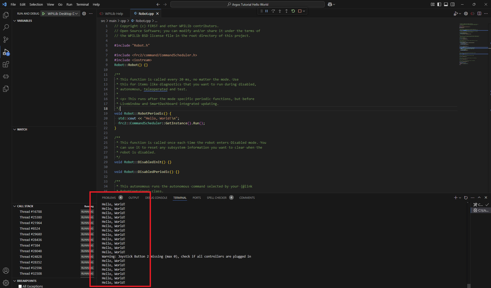

# Hello World in C++
## Overview
Welcome to your first step into the world of programming! In this tutorial, we'll be creating a "Hello, World!" program in C++.

---

## What is "Hello, World!"?

"Hello, World!" is a classic and simple program that, when run, displays the message "Hello, World!" on the screen. It's traditionally the very first program that beginners write when they are learning a new programming language.

The purpose of a "Hello, World!" program is to:
-   Confirm that your programming environment (compiler, editor, etc.) is set up correctly.
-   Introduce you to the basic syntax and structure of a programming language.
-   Give you a small, achievable first win to build your confidence.

Think of it as the programming equivalent of saying "hello" when you meet someone new. It's a simple greeting to the vast world of coding.

Let's get started!

---

## Clone Repository

Before we start coding, you need to get the robot code on your computer. This is called **cloning** a repository.

**Use this repository URL:** `https://github.com/FRC1756-Argos/XRP_Tutorial.git`

For detailed instructions on how to clone the repository, please follow the guide for [cloning a repository](<../../../Git Git Hub/01_Version_Control/index.md#cloning-a-repository>).

Once your repository is cloned, return to this tutorial to write your first lines of C++ code.

---

## Opening Robot.cpp
Now that your project is set up, we need to open the file where we will write our code. We will be writing our code in the `Robot.cpp` file.

In the file explorer on the left side of VS Code, navigate to the `src\main\cpp` folder. Inside this folder, you will find `Robot.cpp`. Double-click it to open it in the editor.  


---

## Writing Code
Now for the fun part - writing the code! We are going to add code that prints "Hello, World!" to the console when our program starts.

### Step 1: Include the Input/Output Library

At the very top of `Robot.cpp`, you'll see several lines that start with `#include`. These lines bring in pre-written code, or libraries, that give us extra functionality. To print to the console, we need the `iostream` library, which stands for Input/Output Stream.

Add the following line with the other includes:
```cpp
#include <iostream>
```

### Step 2: Add the Print Statement

Next, we need to add a line of code that tells the program to print "Hello, World!" to the console. Find the `Robot::RobotPeriodic()` function in `Robot.cpp`.

Inside the `Robot::RobotPeriodic()` function, after the  `{` add the following line:

```cpp
std::cout << "Hello, World!\n";
```
<details>
<summary> your code should now look like this  📊</summary>
    ```cpp
    // Copyright (c) FIRST and other WPILib contributors.
    // Open Source Software; you can modify and/or share it under the terms of
    // the WPILib BSD license file in the root directory of this project.

    #include "Robot.h"

    #include <frc2/command/CommandScheduler.h>

    #include <iostream>

    Robot::Robot() {}

    /**
    * This function is called every 20 ms, no matter the mode. Use
    * this for items like diagnostics that you want to run during disabled,
    * autonomous, teleoperated and test.
    *
    * <p> This runs after the mode specific periodic functions, but before
    * LiveWindow and SmartDashboard integrated updating.
    */
    void Robot::RobotPeriodic() {
    frc2::CommandScheduler::GetInstance().Run();

        std::cout << "Hello, World!\n";
    }
    ```
</details>

**Note:** Don't worry if you don't understand all of this code right now. We will go over all the details in future tutorials. The main goal here is to get your first program running!

---

## Running your code
Now that you've written and saved your code, the next step is to run it and see your message appear!

Need help connecting to the XRP robot? See: [Connecting to the XRP Robot](../../../XRP%20Docs/04_Connecting_to_XRP/index.md)

For detailed instructions, on how to run your code please follow the guide on [how to simulate your robot code](<../../../WPILib%20VSCode%20Docs/04_Simulate%20Robot%20Code/index.md>)

---

## Testing Your Code

Now that you've written your "Hello, World!" program, it's time to test it and ensure everything is working as expected. Once the program is running, look at the console output in the simulation window or the terminal in VS Code. You should see the following message:

```cpp
Hello, World!
```

If you see this message, congratulations! You've successfully written and tested your first C++ program.

---

## Troubleshooting

If you don't see the expected output, here are a few things to check:

- **Did you save your changes?** Make sure you saved the `Robot.cpp` file before building the code.
- **Are there any errors in the terminal?** If the build process failed, carefully read the error messages and fix any issues in your code.
- **Is the simulation running?** Ensure that the simulation window is open and running your program.

Once you've resolved any issues, try running your program again.

---

## Congratulations! 🎉

You've just written and tested your very first C++ program! This is a huge milestone in your programming journey. By completing this tutorial, you've learned how to:

- Set up a project.
- Write and edit C++ code.
- Use basic input/output functionality with `iostream`.
- Test and troubleshoot your program.

This is just the beginning of your adventure into the world of programming and robotics. Keep practicing, experimenting, and building on what you've learned here. The skills you develop will open up endless possibilities for creating amazing projects.

Great job, and welcome to the world of coding!

---

## Challenge: Make It Your Own 🚀

Before you move on, try customizing your program. Pick one or more of these mini‑challenges:

- Change the message to something unique (team name, mascot, or a fun quote).
- Print two (or more) lines by using multiple `std::cout` statements.
- Add a blank line between messages using an extra `\n`.

When you’re happy with your custom version, save it and run again to verify the output. Nice work pushing beyond the basics!

---

