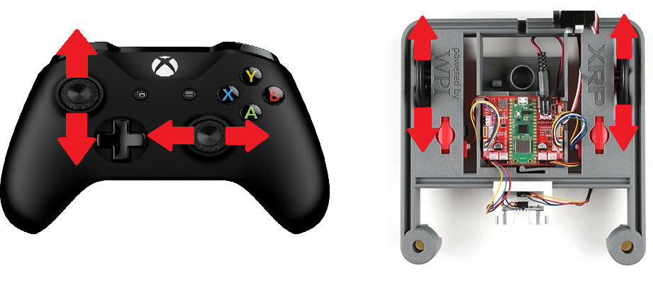
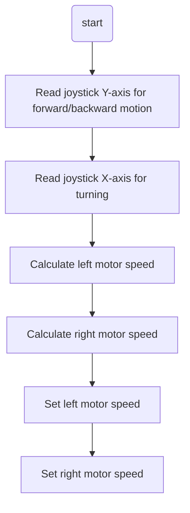

# XRP Arcade Drive  
## Overview
You saw that tank drive gave you a ton of control, but it was really hard to drive smoothly. Then, button drive was super easy to use, but you lost a lot of that fine-tuned control. Now, let's try arcade drive to find a good mix!

Arcade drive may be more familiar, because it is the basis of many video games. One joystick moves the robot forward and backward, and the second joystick turns left and right to do this, we will make the left joystick set a value for both motors and the right joystick will increase or decrease the motor speeds to turn the robot. This control scheme offers less driver control, but it’s easy to learn and many drivers enjoy it  



If you have already implemented the Tank Drive tutorial, you can build on that project to add Arcade Drive functionality. No need to create a new project!

## The Pre-Code Workout 📊

Before writing any code, let's plan our `ArcadeDrive` function. This function will translate joystick inputs into motor speeds, combining forward/backward motion and turning into a single control scheme.

### Inputs and Outputs

The function needs two inputs from the joystick and will produce two outputs to control the motors.

*   **Inputs**:
    1.  **`forward` (double)**: Controls forward/backward motion (from the joystick's Y-axis).
    2.  **`turn` (double)**: Controls turning motion (from the joystick's X-axis).

*   **Outputs**:
    *   **Left Motor Speed**: Calculated as `forward + turn`.
    *   **Right Motor Speed**: Calculated as `forward - turn` (inverted).

### Tasks:
1. Read joystick Y-axis for forward/backward motion.
2. Read joystick X-axis for turning.
3. Calculate left and right motor speeds based on the inputs.
4. Set the motor speeds to control the robot.

### Flow Chart:
<details>
<summary>Flow Chart 📊</summary>


</details>

## Time to Start Coding

## Clone Repository

Before we start coding, you need to get the robot code on your computer. This is called **cloning** a repository.

**Use this repository URL:** `https://github.com/FRC1756-Argos/XRP_Tutorial.git`

For detailed instructions on how to clone the repository, please follow the guide for [cloning a repository](<../../../WPILib VSCode Docs/05_Version_Control/index.md#cloning-a-repository>).

Once your repository is cloned, return to this tutorial to write your first lines of C++ code.

### Create a Drivetrain Subsystem

The first step is to create a subsystem for our drivetrain. See [How to Create a Subsystem](../../../WPILib%20VSCode%20Docs/03_Create_Subsystem_or_Command/index.md#creating-a-subsystem) for instructions on how to do this. You should name your subsystem `Drivetrain`.


### Drivetrain.h Header File

For more information on what header (.h) files are, see [What are Header files](../../../CPP%20Docs/CPP_software_quick_reference/index.md#what-are-header-files-h).

Navigate to your `Drivetrain.h` file. Here are the steps you need to follow:

1. **Include the XRP Motor header.**  
   Add the necessary include statement at the top of your file so you can use the XRP motor objects.  
   If you need help, see the [XRP Motor Quick Reference](../../../XRP%20Docs/02_XRP%20Software%20Quick%20Reference/index.md#xrp-motor).

2. **Add the motor objects.**  
   Create objects for the left and right motors.  
   For more details, refer to the [XRP Motor Quick Reference](../../../XRP%20Docs/02_XRP%20Software%20Quick%20Reference/index.md#xrp-motor).

3. **Add the ArcadeDrive function declaration.**  
   In the `public` section of your class, declare the ArcadeDrive function.  
   If you need help with C++ functions, check the [C++ function Quick Reference](../../../CPP%20Docs/CPP_software_quick_reference/index.md#functions).

<details>
<summary>Your Drivetrain.h file should look like this.</summary>

```cpp
// Copyright (c) FIRST and other WPILib contributors.
// Open Source Software; you can modify and/or share it under the terms of
// the WPILib BSD license file in the root directory of this project.

#pragma once
#include <frc/xrp/XRPMotor.h>
#include <frc2/command/SubsystemBase.h>

class Drivetrain : public frc2::SubsystemBase {
 public:
  Drivetrain();

  /**
   * Will be called periodically whenever the CommandScheduler runs.
   */
  void Periodic() override;

  // ArcadeDrive has two inputs: Speed and Turning.
  void ArcadeDrive(double Speed, double Turning);

 private:
  // Components (e.g. motor controllers and sensors) should generally be
  // declared private and exposed only through public methods.

  // This creates an object for the left and right motor
  frc::XRPMotor m_left_motor{0};
  frc::XRPMotor m_right_motor{1};
};
```
</details>

### Drivetrain.cpp Source File

For more information on what source file (.cpp) files are, see [What are source files](../../../CPP%20Docs/CPP_software_quick_reference/index.md#what-are-source-files-cpp).

Navigate to your `Drivetrain.cpp` file. Here are the steps you need to follow:

1. **ArcadeDrive function definition**
  We will add the `ArcadeDrive` function definition. If you need help with C++ functions, check the [C++ function Quick Reference](../../../CPP%20Docs/CPP_software_quick_reference/index.md#functions).

2. **Adding function body**
  We will now add the function body.  This is where we will do the math to get the left and right motor speeds
  ``` cpp
    // Set the speed of the left and right motors based on the arcade drive inputs
    double left_motor = speed - turning;
    double right_motor = speed + turning;

    m_left_motor.Set(left_motor);
    m_right_motor.Set(right_motor);
  ```

3. **Invert the left motor**
  We need to invert the left motor in the constructor so both motors drive in the same direction. The left and right motors are mounted facing opposite directions on the XRP robot, so we need to invert one of them. We put this in the constructor because it only needs to be set once when the subsystem is created, rather than every time we call the ArcadeDrive function. Add this to the `Drivetrain()` constructor:
  ``` cpp
  Drivetrain::Drivetrain(){
    m_left_motor.SetInverted(true);
  }
  ```

<details>
<summary>Your Drivetrain.cpp file should look like this.</summary>

``` cpp
// Copyright (c) FIRST and other WPILib contributors.
// Open Source Software; you can modify and/or share it under the terms of
// the WPILib BSD license file in the root directory of this project.

#include "subsystems/Drivetrain.h"

Drivetrain::Drivetrain(){
  m_left_motor.SetInverted(true); // Invert the right motor here
};

// This method will be called once per scheduler run
void Drivetrain::Periodic() {}

void Drivetrain::ArcadeDrive(double speed, double turning){
    // Set the speed of the left and right motors based on the arcade drive inputs
    double left_motor = speed - turning;
    double right_motor = speed + turning;

    m_left_motor.Set(left_motor);
    m_right_motor.Set(right_motor);
}
```
</details>


### RobotContainer.h Header File

The `RobotContainer.h` file is where you set up your robot's main structure, including subsystems and input devices. For more information on header files, see [What are Header files](../../../CPP%20Docs/CPP_software_quick_reference/index.md#what-are-header-files-h).

Navigate to your `RobotContainer.h` file. Here’s what you need to do:

1. **Include the Drivetrain Subsystem Header**  
   Add an `#include` statement for your `Drivetrain.h` file so you can use your drivetrain subsystem. If you need help with adding includes see [Include Statements (#include)](../../../CPP%20Docs/CPP_software_quick_reference/index.md#include-statements-include)

2. **Declare the Drivetrain Subsystem**  
   Add a member variable for your `Drivetrain` subsystem.  If you need help see [member veriable declarations](../../../CPP%20Docs/CPP_software_quick_reference/index.md#member-variable-declarations)

3. **Include your xbox controller**  
   Add an include for your xbox controller.   If you need help see [Xbox Controller](../../../WPILib%20VSCode%20Docs/02_WPILib%20Software%20Quick%20Reference/index.md#xbox-controller)

4. **Declare the xbox controller.**  
    Add an xbox controller. If you need help see [Xbox Controller](../../../WPILib%20VSCode%20Docs/02_WPILib%20Software%20Quick%20Reference/index.md#xbox-controller)

5. **Include the RunCommand header**  
   Add `#include <frc2/command/RunCommand.h>` for creating inline commands.

<details>
<summary>Your RobotContainer.h file should look like this:</summary>

```cpp
// Copyright (c) FIRST and other WPILib contributors.
// Open Source Software; you can modify and/or share it under the terms of
// the WPILib BSD license file in the root directory of this project.

#pragma once

#include <frc2/command/CommandPtr.h>

#include "Constants.h"
#include "subsystems/ExampleSubsystem.h"

#include "subsystems/Drivetrain.h"
#include <frc2/command/button/CommandXboxController.h>
#include <frc2/command/RunCommand.h>

/**
 * This class is where the bulk of the robot should be declared.  Since
 * Command-based is a "declarative" paradigm, very little robot logic should
 * actually be handled in the {@link Robot} periodic methods (other than the
 * scheduler calls).  Instead, the structure of the robot (including subsystems,
 * commands, and trigger mappings) should be declared here.
 */
class RobotContainer {
 public:
  RobotContainer();

  frc2::CommandPtr GetAutonomousCommand();

 private:
  // The robot's subsystems are defined here...
  ExampleSubsystem m_subsystem;

  void ConfigureBindings();

  Drivetrain m_drivetrain;
  frc2::CommandXboxController m_driverController{0};

};

```
</details>

### RobotContainer.cpp Source File

The `RobotContainer.cpp` file is where you define how your robot's main container works. This is where you connect your subsystems and input devices, and set up how the robot will be controlled.

Navigate to your `RobotContainer.cpp` file. Here’s what you need to do:

1. **Set default command**  
   Set up the drivetrain's default command to continuously run arcade drive with joystick inputs. Add this code to the `RobotContainer()` constructor:
   ```cpp
   m_drivetrain.SetDefaultCommand(frc2::RunCommand(
       [this] {
         m_drivetrain.ArcadeDrive(m_driverController.GetLeftY(), m_driverController.GetLeftX());
       },
       {&m_drivetrain}));
   ```
   This creates a `RunCommand` that calls the `ArcadeDrive` function with the left joystick's Y-axis (forward/backward) and X-axis (turning) values. The command runs continuously as the drivetrain's default behavior.


<details>
<summary>Your RobotContainer.cpp file should look like this:</summary>

```cpp
// Copyright (c) FIRST and other WPILib contributors.
// Open Source Software; you can modify and/or share it under the terms of
// the WPILib BSD license file in the root directory of this project.

#include "RobotContainer.h"

#include <frc2/command/button/Trigger.h>

#include "commands/Autos.h"
#include "commands/ExampleCommand.h"

RobotContainer::RobotContainer() {
  // Initialize all of your commands and subsystems here

  // Configure the button bindings
  ConfigureBindings();

  m_drivetrain.SetDefaultCommand(frc2::RunCommand(
      [this] {
        m_drivetrain.ArcadeDrive(m_driverController.GetLeftY(), m_driverController.GetLeftX());
      },
      {&m_drivetrain}));
}

void RobotContainer::ConfigureBindings() {
  // Configure your trigger bindings here

  // Schedule `ExampleCommand` when `exampleCondition` changes to `true`
  frc2::Trigger([this] {
    return m_subsystem.ExampleCondition();
  }).OnTrue(ExampleCommand(&m_subsystem).ToPtr());

  // Schedule `ExampleMethodCommand` when the Xbox controller's B button is
  // pressed, cancelling on release.
  m_driverController.B().WhileTrue(m_subsystem.ExampleMethodCommand());
}

frc2::CommandPtr RobotContainer::GetAutonomousCommand() {
  // An example command will be run in autonomous
  return autos::ExampleAuto(&m_subsystem);
}

```
</details>


## Time to test your code
Now that you've implemented the arcade drive functionality, it's time to test your code!

Need help connecting to the XRP robot? See: [Connecting to the XRP Robot](../../../XRP%20Docs/04_Connecting_to_XRP/index.md)

### Deploy and Test

Great job writing your first XRP code.  it is time to test your code. Go to [XRP Run Code](../../../WPILib%20VSCode%20Docs/04_Simulate%20Robot%20Code/index.md) to test your code

### Testing Checklist

- [ ] Robot moves forward when you push the left joystick forward (up)
- [ ] Robot moves backward when you pull the left joystick backward (down)
- [ ] Robot turns right when you push the left joystick to the right
- [ ] Robot turns left when you push the left joystick to the left
- [ ] Robot can move forward/backward and turn at the same time


---

## Challenge: Refine Your Arcade Drive 🚀

Ready to polish the feel of arcade drive? Pick a few of these mini‑challenges:

- Add overall scaling constants in `Constants.h` (e.g., kDriveScale, kTurnScale) and multiply raw joystick values before combining; tune until it feels natural.
- Add input deadband (ignore tiny joystick values) to reduce drift.
- Prevent motor outputs from exceeding [-1, 1] after combining forward and turn.

### Tips
- Change one thing at a time; test immediately.
- Start conservative (lower speeds) then build up.
- Keep notes: which adjustment made driving smoother?

---
