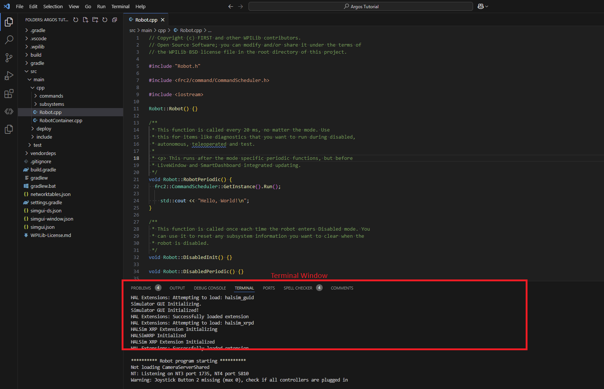
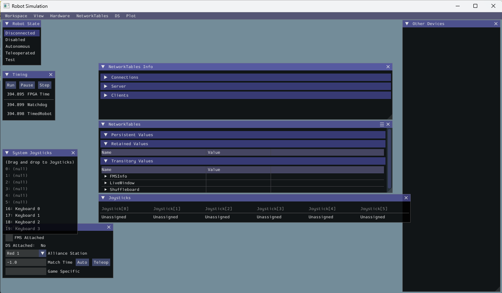

# How to Simulate Robot Code

Simulation is a powerful tool that allows you to run and test your robot code on your computer without needing to connect to a physical robot. This is extremely useful for catching errors early, testing logic, and programming when you don't have access to the hardware.

This guide will walk you through the steps to simulate your robot code using the WPILib simulator. This is also the method used for running code on the XRP robot.

> **Important:** if you are testing your code on a physical XRP robot, you must also have the FRC Driver Station running with the robot enabled. For more details, please see the [FRC Driver Station Overview](../../FRC_Software_Tools/Driver Station/frc_driver_station.md).

for more details about the simulator reference [Robot Simulation WPILib](https://docs.wpilib.org/en/stable/docs/software/wpilib-tools/robot-simulation/simulation-gui.html)

---

## Steps to Simulate

1.  **Open the Command Palette**
    *   Click the WPILib icon in the top-right corner of VS Code.
    *   Alternatively, press `Ctrl+Shift+P`.
    *   

2.  **Find the Simulate Command**
    *   In the prompt that appears, type "Simulate" and select **"WPILib: Simulate Robot Code"**.
    *   

3.  **Wait for the Build**
    *   VS Code will now build your project. You can see the progress in the terminal window at the bottom of the screen. This may take a moment.
    *   
    *   Once the build is complete, a window called "Robot Simulation" will pop up.

> **Note:** If you are following the "Hello, World!" tutorial, you have successfully run your code! You can now return to that tutorial. If you would like to learn more about the robot simulator, please continue reading.

---

## Robot Simulator GUI

When you run the simulation, a window called the **"Robot Simulation"** will appear. This tool lets you interact with the simulated robot's hardware components, like motors and sensors, even though they aren't physically connected.

1. **Robot State**
    * This is the robot’s current state or “mode”. You can click on the labels to change the mode, just as you would on the FRC Driver Station.
        * **Disabled:** Disables the robot.
        * **Autonomous:** Runs the autonomous routines.
        * **Teleoperated:** Allows for manual control of the robot.
        * **Test:** Runs your test commands.
    * Most of your testing will be done using Teleoperated mode.
    > **Note:** When testing XRP code, you must enable the robot and select a robot state (e.g., Teleoperated) for your code to run.
    *   
    
2. **Simulator Joystick**
    * The **System Joysticks** list shows all controllers connected to your computer. To use one in the simulation, drag it from the **System Joysticks** list to the **Joysticks** list below it. This assigns it to a port that your robot code can access.
    

