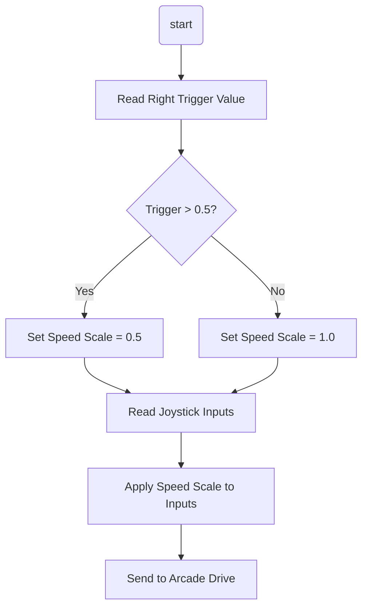

# XRP Slow Speed Mode with Commands

## Overview

Building on the arcade drive tutorial, you'll now add a **slow speed mode** feature to your XRP robot! When you pull the Xbox controller trigger, the robot will enter a slow speed mode that reduces all movement by 50%. This feature is incredibly useful for:

- **Precise positioning** when you need fine control
- **Safety** when operating in tight spaces
- **Learning** to help new drivers get comfortable with robot control

We'll implement this using a **command** to handle the slow speed functionality, giving you more practice with command-based programming while adding a practical feature to your robot.


This tutorial builds directly on the [Arcade Drive Tutorial](../06_Arcade_Drive/index.md). Make sure you've completed that tutorial first!

---

## The Pre-Code Workout 📊

Before writing code, let's plan our `SlowSpeedCommand`:

### What This Command Will Do:
1. **Monitor the controller trigger** - Read the right trigger value
2. **Apply speed reduction** - Multiply all drivetrain inputs by 0.5 when active
3. **Maintain normal arcade drive** - Keep all the same driving behavior, just slower

### Inputs and Outputs:

**Inputs:**
- Right trigger value (0.0 to 1.0)
- Normal arcade drive inputs (forward/turn from joysticks)

**Outputs:**
- Modified motor speeds (50% of normal when trigger is pressed)

### Tasks:
1. Create a `SlowSpeedCommand` that modifies drivetrain behavior
2. Update the drivetrain to support speed scaling
3. Bind the command to the right trigger
4. Test the slow speed functionality

### Flow Chart:

<details>
<summary>Flow Chart 📊</summary>


</details>

---

## Time to Start Coding

### Prerequisites
This tutorial builds on the [Arcade Drive Tutorial](../06_Arcade_Drive/index.md). Make sure you have:
- A working XRP project with arcade drive
- A `Drivetrain` subsystem with `ArcadeDrive()` function
- Xbox controller already configured

If you don't have these, complete the Arcade Drive tutorial first!

### Step 1: Update the Drivetrain Subsystem

First, we need to modify our drivetrain to support speed scaling with a member variable.

#### Update Drivetrain.h

We'll add a speed scale member variable and methods to control it.

Navigate to your `Drivetrain.h` file and add these new declarations:

**In the `public` section:**
```cpp
// Methods to control speed scaling
void SetSpeedScale(double scale);
```

**In the `private` section:**
```cpp
// Speed scale factor (1.0 = normal, 0.5 = half speed)
double m_speedScale = 1.0;
```
:::tip Why do we need m_speedScale? 🤔
Think of `m_speedScale` like the robot's **memory**!

- The robot needs to remember "Am I supposed to go slow or fast?"
- `m_speedScale` is where the robot writes down this answer
- Once written down, the robot remembers until someone changes it
- Without it, the robot would forget immediately!
:::

<details>
<summary>Your updated Drivetrain.h file should look like this:</summary>

```cpp
// Copyright (c) FIRST and other WPILib contributors.
// Open Source Software; you can modify and/or share it under the terms of
// the WPILib BSD license file in the root directory of this project.

#pragma once
#include <frc/xrp/XRPMotor.h>
#include <frc2/command/SubsystemBase.h>

class Drivetrain : public frc2::SubsystemBase {
 public:
  Drivetrain();

  /**
   * Will be called periodically whenever the CommandScheduler runs.
   */
  void Periodic() override;

  // ArcadeDrive has two inputs: Speed and Turning.
  void ArcadeDrive(double speed, double turning);
  
  // Methods to control speed scaling
  void SetSpeedScale(double scale);

 private:
  // Components (e.g. motor controllers and sensors) should generally be
  // declared private and exposed only through public methods.

  // This creates an object for the left and right motor
  frc::XRPMotor m_left_motor{0};
  frc::XRPMotor m_right_motor{1};
  
  // Speed scale factor (1.0 = normal, 0.5 = half speed)
  double m_speedScale = 1.0;
};
```
</details>

#### Update Drivetrain.cpp

Now we'll implement the speed scale methods and update the ArcadeDrive function.

Navigate to your `Drivetrain.cpp` file and add these new function implementations:

```cpp
void Drivetrain::SetSpeedScale(double scale) {
    m_speedScale = scale;
}

```

Also, **update your existing `ArcadeDrive` function** to use the speed scale:

```cpp
void Drivetrain::ArcadeDrive(double speed, double turning) {
    // Apply the current speed scale
    double scaledSpeed = speed * m_speedScale;
    double scaledTurning = turning * m_speedScale;
    
    // Set the speed of the left and right motors
    double left_motor = scaledSpeed + scaledTurning;
    double right_motor = scaledSpeed - scaledTurning;

    m_left_motor.Set(left_motor);
    m_right_motor.Set(right_motor);
}
```

<details>
<summary>Your updated Drivetrain.cpp file should look like this:</summary>

```cpp
// Copyright (c) FIRST and other WPILib contributors.
// Open Source Software; you can modify and/or share it under the terms of
// the WPILib BSD license file in the root directory of this project.

#include "subsystems/Drivetrain.h"

Drivetrain::Drivetrain() = default;

// This method will be called once per scheduler run
void Drivetrain::Periodic() {}

void Drivetrain::ArcadeDrive(double speed, double turning) {
    // Apply the current speed scale
    double scaledSpeed = speed * m_speedScale;
    double scaledTurning = turning * m_speedScale;
    
    // Set the speed of the left and right motors
    double left_motor = scaledSpeed + scaledTurning;
    double right_motor = scaledSpeed - scaledTurning;

    m_left_motor.Set(left_motor);
    m_right_motor.Set(right_motor);
}

void Drivetrain::SetSpeedScale(double scale) {
    m_speedScale = scale;
}

```
</details>

### Step 2: Create the Slow Speed Command

Now let's create a simple command that sets the speed scale when triggered.

See [How to Create a Command](<../../../WPILib%20VSCode%20Docs/03_Create_Subsystem_or_Command/index.md#creating-a-command>) for instructions. You should name your command `SlowSpeedCommand`.

#### SlowSpeedCommand.h Header File

Our command only needs access to the drivetrain since it just sets the speed scale.

1. **Include necessary headers** at the top of `SlowSpeedCommand.h`:

   ```cpp
   #include "subsystems/Drivetrain.h"
   ```

2. **Add constructor that takes the drivetrain**:

   ```cpp
   SlowSpeedCommand(Drivetrain* drivetrain);
   ```

3. **Add private member variable** for the drivetrain:

   ```cpp
   private:
     Drivetrain* m_drivetrain;  // This stores the ADDRESS of the drivetrain
   ```

:::tip What does `Drivetrain* m_drivetrain;` mean? 🤔
Let's break this down:
- `Drivetrain` = The type of thing we're working with (like "house")
- `*` = This means "pointer" or "address of" (like "address of the house")  
- `m_drivetrain` = The name we give to store this address (like "my house address")

So this line says: "Create a variable that stores the **address** of a Drivetrain object, and call it `m_drivetrain`"

It's like having a piece of paper with your friend's house address written on it!

📚 **For more information, check out the [C++ Quick Reference - Pointers section](<../../../CPP%20Docs/CPP_software_quick_reference/index.md#pointers>)**
:::

<details>
<summary>Your SlowSpeedCommand.h file should look like this:</summary>

```cpp
// Copyright (c) FIRST and other WPILib contributors.
// Open Source Software; you can modify and/or share it under the terms of
// the WPILib BSD license file in the root directory of this project.

#pragma once

#include <frc2/command/Command.h>
#include <frc2/command/CommandHelper.h>
#include "subsystems/Drivetrain.h"

/**
 * A command that sets the drivetrain to slow speed mode.
 * Simply changes the speed scale factor for precise control.
 */
class SlowSpeedCommand
    : public frc2::CommandHelper<frc2::Command, SlowSpeedCommand> {
 public:
  SlowSpeedCommand(Drivetrain* drivetrain);

  void Initialize() override;

  void Execute() override;

  void End(bool interrupted) override;

  bool IsFinished() override;

 private:
  Drivetrain* m_drivetrain;
};
```
</details>

#### SlowSpeedCommand.cpp Source File

Now let's implement the slow speed command behavior. Notice how simple this becomes!

1. **Implement the constructor**:

   ```cpp
   SlowSpeedCommand::SlowSpeedCommand(Drivetrain* drivetrain)
       : m_drivetrain(drivetrain) {
     // This command doesn't require the drivetrain since it just sets a variable
     // The default command will continue to control the drivetrain
   }
   ```

2. **Implement the Initialize method**:

   ```cpp
   void SlowSpeedCommand::Initialize() {
     // Set the drivetrain to slow speed mode
     m_drivetrain->SetSpeedScale(0.5);  // The -> means "go to this address and call this function"
   }
   ```

3. **Implement the Execute method**:

   ```cpp
   void SlowSpeedCommand::Execute() {
     // Nothing to do! The drivetrain automatically uses the speed scale
     // The default command continues to handle joystick input
   }
   ```

4. **Implement the End method**:

   ```cpp
   void SlowSpeedCommand::End(bool interrupted) {
     // Return to normal speed when the command ends
     m_drivetrain->SetSpeedScale(1.0);  // The -> means "go to this address and call this function"
   }
   ```

:::tip What does the `->` arrow do? 🤔
The arrow `->` is used when you have a **pointer** (an address) and want to call a function on the object at that address.

Think of it like this:
- `m_drivetrain` = A piece of paper with an address written on it
- `->SetSpeedScale(1.0)` = "Go to that address and call the SetSpeedScale function"

It's a shortcut! Instead of writing `(*m_drivetrain).SetSpeedScale(1.0)`, we just write `m_drivetrain->SetSpeedScale(1.0)`

**Simple rule:** Use `->` with pointers, use `.` with regular objects!
:::

5. **Implement the IsFinished method**:

   ```cpp
   bool SlowSpeedCommand::IsFinished() {
     // This command runs continuously while triggered, so never finishes on its own
     return false;
   }
   ```

<details>
<summary>Your SlowSpeedCommand.cpp file should look like this:</summary>

```cpp
// Copyright (c) FIRST and other WPILib contributors.
// Open Source Software; you can modify and/or share it under the terms of
// the WPILib BSD license file in the root directory of this project.

#include "commands/SlowSpeedCommand.h"

SlowSpeedCommand::SlowSpeedCommand(Drivetrain* drivetrain)
    : m_drivetrain(drivetrain) {
  // This command doesn't require the drivetrain since it just sets a variable
  // The default command will continue to control the drivetrain
}

// Called when the command is initially scheduled.
void SlowSpeedCommand::Initialize() {
  // Set the drivetrain to slow speed mode
  m_drivetrain->SetSpeedScale(0.5);
}

// Called repeatedly when this Command is scheduled to run
void SlowSpeedCommand::Execute() {
  // Nothing to do! The drivetrain automatically uses the speed scale
  // The default command continues to handle joystick input
}

// Called once the command ends or is interrupted.
void SlowSpeedCommand::End(bool interrupted) {
  // Return to normal speed when the command ends
  m_drivetrain->SetSpeedScale(1.0);
}

// Returns true when the command should end.
bool SlowSpeedCommand::IsFinished() {
bool SlowSpeedCommand::IsFinished() {
  // This command runs continuously while triggered, so never finishes on its own
  return false;
}
```
</details>

### Step 3: Update RobotContainer

Now we need to integrate our slow speed command into the robot container and set up the controller bindings.

#### Update RobotContainer.h

We need to add our new command and make sure we have access to our drivetrain.

1. **Include the new command header**:

   ```cpp
   #include "commands/SlowSpeedCommand.h"
   ```

2. **Make sure you have the drivetrain subsystem** (you should already have this from the arcade drive tutorial):

   ```cpp
   #include "subsystems/Drivetrain.h"
   ```

3. **Ensure you have the Xbox controller** (you should already have this):

   ```cpp
   #include <frc2/command/button/CommandXboxController.h>
   ```

<details>
<summary>Your RobotContainer.h file should include these headers and declarations:</summary>

```cpp
// Copyright (c) FIRST and other WPILib contributors.
// Open Source Software; you can modify and/or share it under the terms of
// the WPILib BSD license file in the root directory of this project.

#pragma once

#include <frc2/command/Command.h>
#include <frc2/command/button/CommandXboxController.h>

#include "commands/SlowSpeedCommand.h"
#include "subsystems/Drivetrain.h"

class RobotContainer {
 public:
  RobotContainer();

  frc2::Command* GetAutonomousCommand();

 private:
  void ConfigureBindings();

  // Subsystems
  Drivetrain m_drivetrain;

  // Controllers
  frc2::CommandXboxController m_driverController{0};
};
```
</details>

#### Update RobotContainer.cpp

Now we need to set up the controller binding for our slow speed mode.

In your `ConfigureBindings()` method, add the trigger binding:

```cpp
void RobotContainer::ConfigureBindings() {
  // Configure your trigger bindings here
  
  // Bind slow speed mode to the right trigger
  // WhileTrue means the command runs while the trigger is pressed down
  m_driverController.RightTrigger(0.5).WhileTrue(
    SlowSpeedCommand(&m_drivetrain).ToPtr()  // Much simpler - no controller needed!
  );
}
```

You'll also want to set up a default command for normal driving. Add this in your `RobotContainer()` constructor:  (you should already have this)

```cpp
RobotContainer::RobotContainer() {
  ConfigureBindings();
  
  // Set the default command for the drivetrain to be arcade drive
  // Notice: the speed scale is automatically applied in ArcadeDrive now!
  m_drivetrain.SetDefaultCommand(
    frc2::RunCommand(
      [this] {
        m_drivetrain.ArcadeDrive(
          -m_driverController.GetLeftY(),   // Forward/backward
          m_driverController.GetRightX()    // Turning
        );
      },
      {&m_drivetrain}
    )
  );
}
```

<details>
<summary>Your complete RobotContainer.cpp file should look like this:</summary>

```cpp
// Copyright (c) FIRST and other WPILib contributors.
// Open Source Software; you can modify and/or share it under the terms of
// the WPILib BSD license file in the root directory of this project.

#include "RobotContainer.h"
#include <frc2/command/RunCommand.h>

RobotContainer::RobotContainer() {
  ConfigureBindings();
  
  // Set the default command for the drivetrain to be arcade drive
  // Notice: the speed scale is automatically applied in ArcadeDrive now!
  m_drivetrain.SetDefaultCommand(
    frc2::RunCommand(
      [this] {
        m_drivetrain.ArcadeDrive(
          -m_driverController.GetLeftY(),   // Forward/backward
          m_driverController.GetRightX()    // Turning
        );
      },
      {&m_drivetrain}
    )
  );
}

void RobotContainer::ConfigureBindings() {
  // Configure your trigger bindings here
  
  // Bind slow speed mode to the right trigger
  // WhileTrue means the command runs while the trigger is pressed down
  m_driverController.RightTrigger(0.5).WhileTrue(
    SlowSpeedCommand(&m_drivetrain).ToPtr()  // Much simpler!
  );
}

frc2::Command* RobotContainer::GetAutonomousCommand() {
  // An example command will be run in autonomous
  return nullptr;
}
```
</details>

<details>
<summary>What does the trigger binding code mean?</summary>

Let's break down this line of code:

```cpp
m_driverController.RightTrigger(0.5).WhileTrue(
  SlowSpeedCommand(&m_drivetrain).ToPtr()
);
```

- `m_driverController.RightTrigger(0.5)` - Gets the right trigger and sets a threshold of 0.5 (meaning the trigger needs to be pulled halfway before it's considered "pressed")
- `.WhileTrue(...)` - Runs the command while the trigger is above the threshold. When released below 0.5, the command ends
- `SlowSpeedCommand(&m_drivetrain)` - Creates a new instance of our slow speed command, passing a pointer to the drivetrain
- `.ToPtr()` - Converts the command to a pointer that the scheduler can use

So this line says: "While the right trigger is pulled more than halfway, run the SlowSpeedCommand. When the trigger is released, stop the command and return to normal driving."

</details>

---

## Time to Test Your Code

Congratulations! You've implemented a slow speed mode system. Now let's test it!

Need help connecting to the XRP robot? See: [Connecting to the XRP Robot](../../../XRP%20Docs/04_Connecting_to_XRP/index.md)

### Testing Steps:

1. **Build your code** - Make sure there are no compilation errors
2. **Deploy to simulator** - Follow the [XRP Simulation Guide](<../../../WPILib%20VSCode%20Docs/04_Simulate%20Robot%20Code/index.md>)
3. **Test the functionality**:
   - Connect an Xbox controller to your computer
   - Start the robot code and enable it
   - Try normal driving with the joysticks
   - Pull the **right trigger** and notice the speed difference

### What Should Happen:

**Normal Mode (trigger not pressed):**
- Left joystick controls forward/backward at full speed
- Right joystick controls turning at full speed
- Robot responds quickly to inputs

**Slow Speed Mode (right trigger pulled):**
- Same joystick controls work, but at 50% speed
- More precise control for fine movements
- Easier to make small adjustments

**Switching Between Modes:**
- Pulling the trigger should immediately switch to slow mode
- Releasing the trigger should immediately return to normal speed
- The transition should be smooth and responsive

### Testing Tips:

1. **Test the threshold**: The trigger needs to be pulled at least halfway (0.5) to activate
2. **Try gradual pulls**: Pull the trigger slowly to feel when it activates
3. **Test while moving**: Try switching modes while the robot is already moving
4. **Verify joystick response**: Make sure both joysticks work correctly in slow mode

### Troubleshooting:

**If slow speed mode doesn't activate:**
- Check that you're pulling the **right trigger** (not left)
- Make sure you're pulling it more than halfway
- Verify your controller is connected to USB port 0
- Check the console for any error messages

**If the robot doesn't move at all:**
- Make sure the robot code is enabled (not just running)
- Check that your default command is set up correctly
- Verify the drivetrain is working in normal mode first

**If slow speed mode is too fast/slow:**
- Adjust the `slowSpeedScale` value in `SlowSpeedCommand.cpp`
- Try values like 0.3 (30%) for even slower, or 0.7 (70%) for less reduction

---

## Congratulations! 🎉

You've successfully implemented a slow speed mode system! This is a significant step in robot programming that combines several important concepts.

### What You Accomplished:

- ✅ **Extended a subsystem** with new functionality
- ✅ **Created a command** that modifies robot behavior
- ✅ **Used trigger bindings** for analog input control
- ✅ **Implemented command scheduling** with proper requirements
- ✅ **Built a practical feature** that real robots use

### What You Learned:

1. **Command-Based Architecture** - How commands can modify and control subsystem behavior
2. **Controller Integration** - Using analog triggers for smooth feature activation
3. **Subsystem Extensions** - Adding new methods to existing subsystems
4. **Default Commands** - How the robot behaves when no other commands are running
5. **Command Requirements** - Ensuring only one command controls the drivetrain at a time

### Real-World Applications:

This slow speed mode technique is used in real FRC robots for:
- **Precision scoring** when placing game pieces
- **Endgame climbing** when exact positioning is critical
- **Defense mode** when you need careful maneuvering
- **Driver training** to help new drivers learn robot control

### Next Steps:

Now that you understand trigger-based commands and subsystem modifications, you can:
- Add multiple speed modes (fast, normal, slow, precision)
- Create commands for other robot systems (arm, intake, shooter)
- Implement more complex controller schemes
- Learn about autonomous commands and command groups

Excellent work! You're becoming proficient with command-based programming and building practical robot features. 🤖

---

## Challenge: Master Your Speed Modes 🚀

Ready to push your slow speed mode further? Try one or more of these mini‑challenges:

- Add a “precision mode” (even slower, e.g., 25% speed) on a different button or trigger.
- Make the slow speed scale value a named constant in `Constants.h` and reference it everywhere.
- Add a dashboard printout or controller rumble when slow mode is active.

### Tips
- Change one thing at a time and test.
- Ask drivers for feedback on which mode feels best.
- Keep your constants organized for easy tuning.


---
